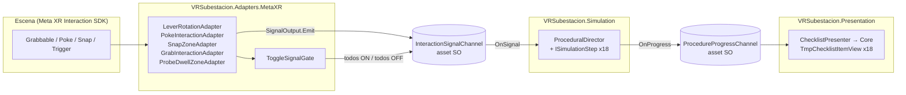
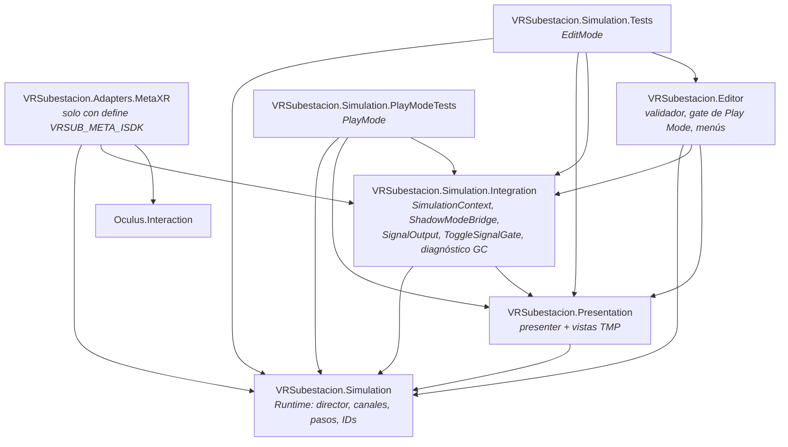

# SIMSUD — Guía de arquitectura y migración técnica

Simulador VR de maniobra en subestación (Meta Quest 3, Unity 6000.0.56f1, Meta XR Interaction SDK).
Esta guía describe la arquitectura nueva (`Assets/Simulation`), cómo convive con el flujo anterior
(`Assets/Scripts`: `CheckList`, `SubstationProcedureManager`, `ChecklistInteractable`…) y cómo extenderla.

---

## 1. Visión general

La interacción física y la lógica del procedimiento están desacopladas por **canales ScriptableObject**:



- Los **adaptadores** solo conocen el canal de entrada y una lista de señales (`SignalOutput`).
- El **director** solo conoce canales; no sabe de escena, UI ni Meta XR.
- La **UI** solo conoce el canal de progreso y los `StepId`; no referencia al director.
- `SimulationContext` es la raíz de composición de la escena; `ShadowModeBridge` decide qué arquitectura está activa.

### 1.1 Assembly definitions



| Assembly | Carpeta | Depende de | Notas |
|---|---|---|---|
| `VRSubestacion.Simulation` | `Assets/Simulation/Runtime` | — | Sin dependencias externas. Testeable sin escena. |
| `VRSubestacion.Presentation` | `Assets/Simulation/Presentation` | Simulation, TextMeshPro, UGUI | |
| `VRSubestacion.Simulation.Integration` | `Assets/Simulation/Integration` | Simulation, Presentation | MonoBehaviours de escena. |
| `VRSubestacion.Adapters.MetaXR` | `Assets/Simulation/Adapters/MetaXR` | Simulation, Integration, Oculus.Interaction | `defineConstraints: VRSUB_META_ISDK`, activado por `versionDefines` cuando `com.meta.xr.sdk.interaction >= 81.0.0`. |
| `VRSubestacion.Editor` | `Assets/Simulation/Editor` | Simulation, Integration, Presentation | Solo Editor. |
| `VRSubestacion.Simulation.Tests` | `Assets/Tests/EditMode` | todas + Editor | Solo Editor. |
| `VRSubestacion.Simulation.PlayModeTests` | `Assets/Tests/PlayMode` | Simulation, Presentation, Integration | |

La dirección de dependencias nunca se invierte: Runtime no conoce a nadie; los adaptadores son la única pieza
que toca Meta XR, así que cambiar de SDK (p. ej. XR Interaction Toolkit) implica solo un assembly nuevo de adaptadores.

### 1.2 Canales ScriptableObject

| Canal | Payload | Publica | Escucha |
|---|---|---|---|
| `InteractionSignalChannel` | `readonly struct InteractionSignal { int SignalId; int Payload; }` | Adaptadores, `ToggleSignalGate` | `ProceduralDirector` |
| `ProcedureProgressChannel` | `readonly struct ProcedureProgress { Kind, State, StepId, StepIndex, CompletedCount, StepCount }` | `ProceduralDirector` | `ChecklistPresenterCore` |

- Se crean desde `Create → VR Subestacion → …` o con `VR Subestacion/Validation/Create Missing Channel Assets`.
- Debe existir **un asset de cada canal** y todo (contexto, adaptadores) debe apuntar al mismo; el validador lo comprueba.
- `Raise` recorre un array preasignado de listeners (sin `List`, sin `event`/`Action` multicast) y pasa los
  structs por `in`: no hay asignaciones en heap por señal.
- Los listeners se limpian en `OnEnable`/`OnDisable` del asset, así que no sobreviven entre sesiones de Play.

### 1.3 State Pattern del procedimiento

- `ISimulationStep`: `StepId`, `ExpectedSignalId`, `OnEnter()`, `OnExit()`, `TryAdvance(in InteractionSignal)`, `Tick(float)`.
- `SignalMatchSimulationStep`: base de los 18 pasos; completa solo si `SignalId == ExpectedSignalId`.
- `SubstationSteps.cs`: una clase sellada por paso (`BajarSwitchPrincipalStep`, …).
- `SubstationProcedureFactory`: construye el array de pasos **una vez** y expone `OrderedSignalIds`.
- `ProceduralDirector`: mantiene el índice del paso actual. Al recibir una señal:
  1. ignora todo si no arrancó o ya terminó;
  2. pregunta al paso actual `TryAdvance`; las señales fuera de orden se descartan;
  3. `OnExit` del actual → publica `Completed` → `OnEnter` del siguiente → publica `Active`
     (o `ProcedureCompleted` si era el último).
- `SimulationBinder`: ciclo de vida sin MonoBehaviour (`Unbound → Bound → Running`), con validación de canales.

Secuencia de eventos de progreso de un procedimiento completo (verificada por los tests PlayMode):
`ProcedureStarted`, `Active(1)`, `Completed(1)`, `Active(2)`, …, `Completed(18)`, `ProcedureCompleted` (38 eventos).

### 1.4 Integración en escena

| Componente | Execution order | Responsabilidad |
|---|---|---|
| `ShadowModeBridge` | −1000 | Habilita/deshabilita los grupos legacy y clean en `Awake`. |
| `SimulationContext` | −500 | `Awake`: crea el binder (única asignación). `OnEnable`: inyecta el canal de progreso en los presenters y enlaza. `Start`: arranca el procedimiento. `Update`: `Tick`. `OnDisable`: desenlaza. |
| `ChecklistPresenter` | 0 | Envuelve `ChecklistPresenterCore`; solo escribe en las vistas cuando cambia el estado. Strings precalculados. |
| `SimulationAllocationMonitor` | 10000 | Diagnóstico opcional de GC (sección 4). |

Deshabilitar y volver a habilitar `SimulationContext` **no** reinicia el procedimiento (`Start` corre una sola vez);
usa `SimulationContext.RestartProcedure()` para reiniciar.

### 1.5 Adaptadores Meta XR

Todos siguen las mismas reglas: delegados cacheados en `Awake`, suscripción en `OnEnable` / baja en `OnDisable`,
cero asignaciones en los callbacks y salida exclusivamente por `SignalOutput`. Son componentes **aditivos**: conviven
con los scripts legacy del mismo objeto sin modificarlos.

| Adaptador | Fuente ISDK | Salidas | Reemplaza / convive con |
|---|---|---|---|
| `LeverRotationAdapter` | `IPointable` del Grabbable + ángulo con histéresis (`LeverAngleMath`) | `onSwitchedOn`, `onSwitchedOff`, opcional `ToggleSignalGate` | `LeverProcedureInteractable`, `ProcedureToggleInteractable`, `SlidingDoor` |
| `PokeInteractionAdapter` | `IPointable` (Poke o Ray) | `onPressed`, `onReleased` | `PushButton` |
| `SnapZoneAdapter` | `IInteractableView` del `SnapInteractable`, filtro opcional de interactor | `onSnapped`, `onUnsnapped` | `PadlockReceiver` |
| `GrabInteractionAdapter` | uno o varios `IInteractableView` de agarre | `onGrabbed`, `onReleased` | `PadlockGrabber`, `DetectorGrabber` |
| `ProbeDwellZoneAdapter` | Trigger + agarre del detector + tiempo de permanencia | `onVerified`, `ToggleSignalGate` | `VoltageDetectorTarget` |
| `ToggleSignalGate` (Integration) | N miembros binarios (`ToggleGroupLatch`) | `onAllOn`, `onAllOff` | `ProtectoresGroup`, `VoltageDetectorGroup` |

---

## 2. Shadow Mode: activar / desactivar

`ShadowModeBridge` (un único componente por escena) tiene tres modos:

| Modo | Flujo anterior | Arquitectura nueva | Uso |
|---|---|---|---|
| `Legacy` (por defecto) | activo | apagada, nunca enlaza | Producción mientras se valida la migración. |
| `Shadow` | activo | activa en paralelo, observando | Comparar ambos checklists en la misma sesión. |
| `Clean` | apagado | activa | Destino final de la migración. |

### 2.1 Configuración en la escena

1. Añade `VR Subestacion/Shadow Mode Bridge` a un GameObject raíz que **no** forme parte de ningún grupo.
2. **Legacy Behaviours**: `CheckList`, `SubstationProcedureManager`, `ChecklistInteractable`, etc.
3. **Legacy Objects**: el `ChecklistPanel` del checklist anterior.
4. **Clean Behaviours**: `SimulationContext`, `ChecklistPresenter`, adaptadores Meta XR.
5. **Clean Objects**: el panel nuevo con las filas `TmpChecklistItemView`.
6. Ejecuta `VR Subestacion/Validation/Validate Simulation Wiring` (también corre al pulsar Play; con
   `Block Play Mode On Wiring Errors` activado, los errores cancelan la entrada a Play Mode).

El bridge nunca crea, destruye ni re-parenta nada y nunca se desactiva a sí mismo. Al cambiar de modo primero
apaga el grupo saliente y luego enciende el entrante, para que no haya dos dueños de la UI a la vez.

### 2.2 Cambiar de modo

- **Inspector**: cambia `Mode`. En Play Mode se aplica en caliente (`OnValidate`).
- **Código**: `bridge.SetMode(ArchitectureMode.Clean)`.
- **Build** (anula el Inspector): en `Player Settings → Scripting Define Symbols` añade
  `VRSUB_FORCE_LEGACY` o `VRSUB_FORCE_CLEAN`. El validador informa cuando el Inspector está anulado.

Al pasar de `Legacy` a `Shadow`/`Clean` por primera vez, `SimulationContext.Start` arranca el procedimiento en el
siguiente frame. Volver a `Legacy` desenlaza el director (las señales se ignoran) y volver a `Shadow`/`Clean`
continúa en el mismo paso.

### 2.3 Checklist de corte a `Clean`

1. Los tests EditMode y PlayMode pasan en verde.
2. En `Shadow`, el checklist nuevo y el anterior avanzan igual durante un procedimiento completo en el visor.
3. El monitor de GC no reporta violaciones (sección 4).
4. Cambia a `Clean` (o define `VRSUB_FORCE_CLEAN` en la build) y repite la prueba en el visor.
5. Solo entonces elimina los scripts legacy y vacía los grupos Legacy del bridge.

---

## 3. Señales de interacción

`ProcedureStepIds` e `InteractionSignalIds` son 1:1 (mismo valor entero). `ProcedureSignal` y `ProcedureStep` son
los enums serializables que aparecen en el Inspector.

> **Los valores son persistentes**: escenas y prefabs guardan el entero. Nunca renumeres ni reutilices un valor.

| Orden | `InteractionSignalIds` | Valor | Adaptador sugerido → salida |
|---|---|---|---|
| 1 | `BajarSwitchPrincipal` | 1 | `LeverRotationAdapter` del switch principal → `onSwitchedOn` |
| 2 | `BajarProtectores` | 2 | `LeverRotationAdapter` por protector → `ToggleSignalGate.onAllOn` |
| 3 | `ApagarSubestacion_BotonRojo` | 3 | `PokeInteractionAdapter` del botón rojo → `onPressed` |
| 4 | `SubirProtectores` | 4 | Mismo `ToggleSignalGate` de protectores → `onAllOff` |
| 5 | `ColocarCandado` | 5 | `SnapZoneAdapter` del receptor del candado → `onSnapped` |
| 6 | `VerificarBarrasPuerta1_Abajo` | 6 | `ProbeDwellZoneAdapter` por barra → `ToggleSignalGate.onAllOn` |
| 7 | `VerificarBarrasPuerta1_Arriba` | 7 | `ProbeDwellZoneAdapter` por barra → `ToggleSignalGate.onAllOn` |
| 8 | `VerificarBarrasPuerta2` | 8 | `ProbeDwellZoneAdapter` por barra → `ToggleSignalGate.onAllOn` |
| 9 | `VerificarChocolatito` | 9 | `ProbeDwellZoneAdapter` → `onVerified` |
| 10 | `BajarPalancasPuerta1` | 10 | `LeverRotationAdapter` por palanca → `ToggleSignalGate.onAllOn` |
| 11 | `ColocarPulpo_Tierra` | 11 | `SnapZoneAdapter` de tierra → `onSnapped` |
| 12 | `ColocarPulpo_Barras` | 12 | `SnapZoneAdapter` de barras → `onSnapped` |
| 13 | `SenalizarZona` | 13 | `SnapZoneAdapter` de la señalización → `onSnapped` |
| 14 | `RetirarPulpo` | 14 | `SnapZoneAdapter` de barras → `onUnsnapped` |
| 15 | `SubirPalancasPuerta1` | 15 | Mismo `ToggleSignalGate` de palancas → `onAllOff` |
| 16 | `SubirSwitchPrincipal` | 16 | `LeverRotationAdapter` del switch principal → `onSwitchedOff` |
| 17 | `QuitarCandado` | 17 | `SnapZoneAdapter` del candado → `onUnsnapped` |
| 18 | `EncenderSubestacion_BotonRojo` | 18 | `PokeInteractionAdapter` del botón rojo → `onPressed` |

La columna de adaptadores es el mapeo recomendado según el tipo de interacción; la referencia real es lo que está
cableado en la escena (compruébalo con el validador).

**Un objeto, varias señales**: `SignalOutput.signals` es una lista y el director solo acepta la señal del paso actual.
Por eso el botón rojo puede emitir `[ApagarSubestacion_BotonRojo, EncenderSubestacion_BotonRojo]` en `onPressed`, y
el candado `ColocarCandado` en `onSnapped` y `QuitarCandado` en `onUnsnapped`.
**No pongas en la misma lista señales de pasos consecutivos**: un solo evento avanzaría los dos pasos.

### 3.1 Mapear un objeto interactuable nuevo a un paso existente

1. En el objeto, deja el componente ISDK (`Grabbable`, `PokeInteractable`, `SnapInteractable`…).
2. Añade el adaptador correspondiente (tabla 1.5) y asigna su referencia de interfaz (`pointable`, `snapZone`…).
3. En cada `SignalOutput`: `channel` = el asset `InteractionSignalChannel`; `signals` = las señales del paso.
4. Si el paso requiere que **varios** objetos cambien (palancas, protectores, barras), crea un `ToggleSignalGate`
   con `expectedMembers` = número de objetos, configura `onAllOn`/`onAllOff` y asigna el gate en cada adaptador
   (los miembros se registran solos al habilitarse).
5. Añade el adaptador a **Clean Behaviours** del `ShadowModeBridge`.
6. Ejecuta `Validate Simulation Wiring` (detecta adaptadores que emiten a un canal que el director no escucha).

### 3.2 Añadir un paso nuevo al procedimiento

1. `ProcedureIds.cs`: nueva constante en `ProcedureStepIds` (siguiente valor libre, p. ej. `19`) y su alias en `InteractionSignalIds`.
2. `ProcedureStep.cs` y `ProcedureSignal.cs`: nuevo miembro con ese mismo valor.
3. `Steps/SubstationSteps.cs`: nueva clase `sealed` que herede de `SignalMatchSimulationStep`
   (o implementa `ISimulationStep` si necesita lógica temporal en `Tick`; sin asignaciones en heap).
4. `SubstationProcedureFactory`: insértalo en `CreateSteps()` y en `OrderedSignalIds` en la posición correcta y
   actualiza `StepCount`.
5. `ChecklistPresenter`: añade la fila (`step`, `view`, `title`) en el panel nuevo.
6. Cablea el objeto según 3.1 y ejecuta los tests: los de ciclo completo recorren `OrderedSignalIds`, así que
   cubren el paso nuevo sin cambios.

### 3.3 Añadir un tipo de interacción nuevo

Crea un adaptador en `Assets/Simulation/Adapters/MetaXR` (o en un assembly nuevo para otro SDK) que:
cachee delegados en `Awake`, se suscriba en `OnEnable` y se dé de baja en `OnDisable`, no asigne en callbacks
ni en `Update`, y emita solo con `SignalOutput.Emit()`. No debe referenciar al director ni a la UI.

---

## 4. Rendimiento: GC.Alloc cero a 90 Hz

A 90 Hz el presupuesto de frame es 11,1 ms; un GC en Quest 3 puede costar varios frames. Regla: **cero
asignaciones en heap en el bucle de simulación después del warmup**. Toda asignación ocurre en construcción
(`Awake`, `CreateSteps`, precálculo de strings del presenter).

### 4.1 Instrumentación

- `SimulationProfilerMarkers` (Runtime): marcadores `VRSub.Simulation.Start`, `VRSub.Simulation.OnSignal` y
  `VRSub.Simulation.Tick` en `ProceduralDirector`. Búscalos en la vista *Hierarchy* del Profiler (también con
  Deep Profile) para ver la cascada completa director → canal → presenter → TMP.
- `SimulationAllocationProbe` (Runtime): mide los bytes asignados dentro de esos scopes (solo el más externo).
  Apagada no lee el GC. Solo mide en el Editor (`GC.GetAllocatedBytesForCurrentThread`); en players es no-op.
- `SimulationAllocationMonitor` (Integration, `Add Component → VR Subestacion/Diagnostics`):
  - tras `warmupFrames` (180 = 2 s a 90 Hz) enciende la sonda y registra un error por cada frame en que el bucle
    de simulación asignó;
  - lee el contador `GC Allocated In Frame` del Profiler (frame completo, incluye Meta XR y el resto de scripts)
    y cuenta los frames por encima de `frameAllocationBudgetBytes`;
  - al deshabilitarse escribe un resumen (error si hubo violaciones en el bucle).
- Menú `VR Subestacion/Profiling`: `Open Profiler`, `Deep Profile (Editor)` (fuera de Play Mode, recompila el dominio)
  y `Add Allocation Monitor To Simulation Context`.

### 4.2 Procedimiento en Editor

1. `VR Subestacion/Profiling/Add Allocation Monitor To Simulation Context`.
2. Play en modo `Shadow` o `Clean`; completa el procedimiento (o ejecuta los tests PlayMode).
3. Sal de Play y revisa el resumen. Si hay violaciones, activa `Deep Profile (Editor)`, repite y en el Profiler
   filtra por `VRSub.Simulation` y por `GC.Alloc` para localizar la llamada.

### 4.3 Procedimiento en Quest 3

1. `Build Settings`: Development Build + Autoconnect Profiler (y Deep Profiling Support solo si hace falta;
   distorsiona los tiempos).
2. Con el monitor en escena, el contador de frame completo funciona en el visor; la sonda acotada no
   (IL2CPP), así que usa el Profiler conectado y los marcadores `VRSub.Simulation.*` para atribuir asignaciones.
3. Verifica que los marcadores `VRSub.Simulation.*` muestran `GC Alloc = 0 B` durante un procedimiento completo.

### 4.4 Tests automáticos

- EditMode `ChecklistPresenterTests.FullProcedureCycle_DoesNotAllocateAfterWarmup`: director + canal + presenter core.
- PlayMode `SimulationAllocationPlayModeTests.SimulationLoop_AfterWarmup_HasZeroGCAlloc`: escena completa con
  `SimulationContext`, presenter y vistas TMP bajo un `Canvas`; señales emitidas desde `Update`; 2 ciclos de
  warmup y 3 medidos + 30 frames de `Tick`.
- PlayMode `SimulationAllocationPlayModeTests.AllocationMonitor_MeasuresAfterWarmupAndReportsCleanLoop`.

---

## 5. Tests

| Suite | Carpeta | Cubre |
|---|---|---|
| EditMode | `Assets/Tests/EditMode` | Director, latch, presenter, binder, bridge, contexto, validador de cableado. |
| PlayMode | `Assets/Tests/PlayMode` | Ciclo de vida real (`Awake` → `OnEnable` → `Start` → `Update`), procedimiento completo frame a frame con verificación de UI, señales fuera de orden, desactivar/reactivar contexto, reinicio, cambios de Shadow Mode en caliente y GC cero. |

`SimulationRig` (PlayMode) construye la escena mínima por código con la raíz inactiva, de modo que `Awake`/`OnEnable`
corren con todo cableado, igual que al cargar la escena real. `ScriptedSignalEmitter` sustituye a un adaptador.

Ejecutar: `Window → General → Test Runner` → pestañas *EditMode* y *PlayMode* → *Run All*.
Los tests de Shadow Mode se excluyen automáticamente si la build define `VRSUB_FORCE_LEGACY` o `VRSUB_FORCE_CLEAN`.

---

## 6. Mapa de archivos

```
Assets/Simulation/
├── Runtime/                     VRSubestacion.Simulation
│   ├── Diagnostics/             SimulationAllocationProbe, SimulationSampleScope (+ markers)
│   ├── Steps/                   SignalMatchSimulationStep, SubstationSteps
│   ├── InteractionSignal(.cs|Channel.cs), ProcedureProgress(.cs|Channel.cs)
│   ├── ProceduralDirector, SimulationBinder, SubstationProcedureFactory
│   └── ProcedureIds, ProcedureStep, ProcedureSignal, ToggleGroupLatch, LeverAngleMath
├── Presentation/                VRSubestacion.Presentation
├── Integration/                 VRSubestacion.Simulation.Integration
│   └── Diagnostics/             SimulationAllocationMonitor
├── Adapters/MetaXR/             VRSubestacion.Adapters.MetaXR
└── Editor/                      VRSubestacion.Editor (validador, gate, inspector, menú de profiling)
Assets/Tests/
├── EditMode/                    VRSubestacion.Simulation.Tests
└── PlayMode/                    VRSubestacion.Simulation.PlayModeTests
```
