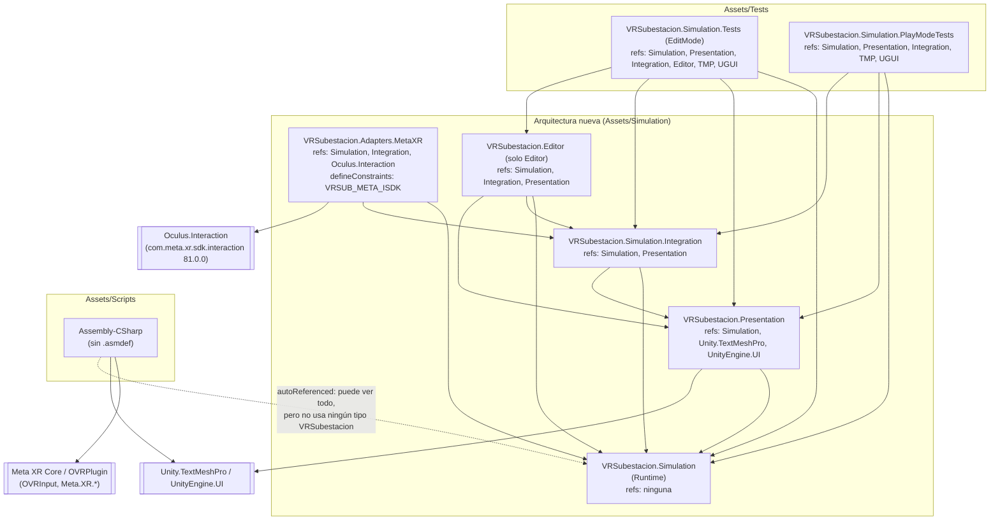
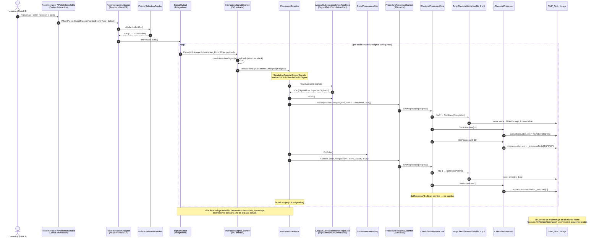
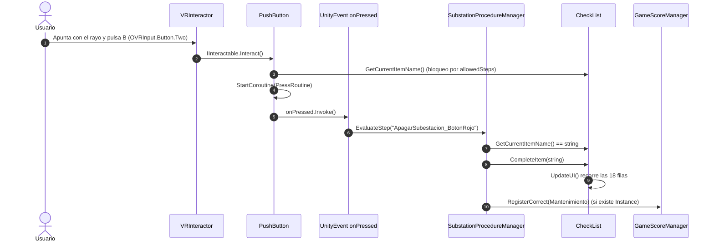

# SIMSUD — Auditoría técnica exhaustiva del código C#

| Campo | Valor |
|---|---|
| Proyecto | VR-Subestacion (SIMSUD) — Meta Quest 3 |
| Motor | Unity `6000.0.56f1` · Meta XR SDK `81.0.0` (`com.meta.xr.sdk.interaction` 81.0.0) |
| Commit auditado | `8898e941` ("Etapa 6") |
| Fecha | 2026-10-03 |
| Alcance | Todo `*.cs` bajo `Assets/Scripts`, `Assets/Simulation` y `Assets/Tests` + los 7 `.asmdef` |
| Escena de referencia | `Assets/Scenes/GameSubestacion.unity` (única escena en Build Settings) |
| Inventario en disco | **82** archivos C# confirmados (`Get-ChildItem -Recurse -Filter *.cs` sobre las tres carpetas). El encargo estimaba ~32: coinciden con el bloque legacy (`Assets/Scripts`). |
| Método | Lectura completa de cada archivo, análisis de `.asmdef`, búsqueda de `using`/símbolos (`Oculus`/`Meta.XR`/`UnityEditor`/`VRSubestacion`), y parseo del YAML de la escena por GUID de script |

---

## 0. Resumen ejecutivo

### 0.1 Alcance real

El encargo estimaba ~32 scripts. El inventario real es **82 archivos C#**:

| Bloque | Archivos | Assembly |
|---|---:|---|
| `Assets/Scripts` (flujo anterior) | 32 | `Assembly-CSharp` (sin `.asmdef`) |
| `Assets/Simulation/Runtime` | 19 | `VRSubestacion.Simulation` |
| `Assets/Simulation/Presentation` | 6 | `VRSubestacion.Presentation` |
| `Assets/Simulation/Integration` | 5 | `VRSubestacion.Simulation.Integration` |
| `Assets/Simulation/Adapters/MetaXR` | 6 | `VRSubestacion.Adapters.MetaXR` |
| `Assets/Simulation/Editor` | 5 | `VRSubestacion.Editor` |
| `Assets/Tests/EditMode` | 5 | `VRSubestacion.Simulation.Tests` |
| `Assets/Tests/PlayMode` | 4 | `VRSubestacion.Simulation.PlayModeTests` |
| **Total** | **82** | |

Los ~32 estimados coinciden con el bloque legacy. Este informe cubre los 82 archivos, uno por uno. Fuera de `Assets` hay además un `SimulationAllocationMonitor.cs` de 0 bytes en la raíz del repositorio: Unity no lo compila; se documenta en el anexo A.

### 0.2 Veredicto

| Área | Resultado |
|---|---|
| Fronteras de assemblies (arquitectura nueva) | **Cumple.** Solo `VRSubestacion.Adapters.MetaXR` importa `Oculus.Interaction`. Runtime no referencia ningún assembly; Presentation solo Runtime + TMP/UGUI. |
| Comunicación adaptador → núcleo | **Cumple, con un matiz.** Los adaptadores emiten solo por `SignalOutput` → `InteractionSignalChannel` (SO). El matiz: también pueden llamar directamente a un `ToggleSignalGate` (MonoBehaviour de Integration), que a su vez emite al mismo canal SO. Ningún adaptador referencia al director ni a la UI. |
| Zero GC en el bucle de simulación | **Cumple** (por código y por tests EditMode/PlayMode). Las asignaciones ocurren solo en construcción (`Awake`, `CreateSteps`, precálculo de strings). |
| Zero GC en legacy | **No cumple** en varios scripts (ver 0.3). |
| Integración en `GameSubestacion` | **Pendiente.** La escena **no contiene** `ShadowModeBridge`, `SimulationContext`, `ChecklistPresenter`, `TmpChecklistItemView` ni ningún adaptador, y **no existen** los assets de canal (`Assets/Simulation/Channels/*.asset`). Tampoco hay `PokeInteractable`/`SnapInteractable`/`Grabbable` en los objetos del procedimiento (solo en dos `[BuildingBlock] Cube` de demo). Hoy la escena corre 100 % legacy. |

### 0.3 Hallazgos críticos y altos

| # | Severidad | Archivo | Hallazgo |
|---|---|---|---|
| H1 | Crítica | `Assets/Scripts/Event/GameEvent.cs` | `using UnityEditor;` **sin uso** y sin `#if UNITY_EDITOR` en un ScriptableObject de runtime (`Assembly-CSharp`). El import no se referencia en el cuerpo; igual rompe la compilación del player (Android / IL2CPP) porque `UnityEditor.dll` no existe fuera del Editor. |
| H2 | Alta | `Assets/Scripts/LeverSwitch.cs` | El archivo declara `class HingedDoor`. Unity exige que el nombre de clase coincida con el del archivo: los **2 componentes** serializados en `Protector temporal` y `Protector temporal (1)` no pueden cargarse. |
| H3 | Alta | Escena `GameSubestacion` | El flujo legacy no tiene cableado para los pasos 10–15, 17 y 18 (ver 5.1). El procedimiento anterior no puede completarse en esta escena. |
| H4 | Alta | Escena / `Assets/Simulation/Channels` | Arquitectura nueva sin instanciar (ver 0.2). El validador (`Validate Simulation Wiring`) reporta "no usan la arquitectura nueva" y no puede detectarlo como error. |
| H5 | Media | `ElectricArcRenderer.cs` | Asigna `List<Vector3>` por iteración, `Vector3[]` y `ToArray()` **cada frame** con el arco activo. |
| H6 | Media | `ControlerArc.cs` | `gameObject.tag` (asigna un string por llamada) dentro de bucles y triggers; usar `CompareTag`. |
| H7 | Media | `CheckList.cs`, `VRInteractor.cs` | Acoplamiento legacy directo a Meta XR: `using Meta.XR.ImmersiveDebugger.UserInterface.Generic` (sin uso; obliga a calificar `UnityEngine.UI.Image`), `using Meta.XR`, `OVRInput`, `GameObject.Find("OVRCameraRig")`. |
| H8 | Media | `EPPCompletionController.cs` | `nextSceneName = "EscenaMantenimiento"` no existe como escena; y `GameScoreManager` (con `DontDestroyOnLoad`) solo vive en `GameEPPS`, que no está en Build Settings. |
| H9 | Baja | `ToggleGroupLatch.cs` / `ToggleSignalGate.cs` | `AllOn` se calcula contra la **capacidad** (`expectedMembers`), no contra los miembros registrados. Si se registran menos miembros de los esperados, el paso nunca se completa y el validador no lo detecta. |
| H10 | Baja | Repositorio | `Library/` aparece como no versionado en `git status`: falta una regla en `.gitignore`. 8 scripts legacy no están en UTF-8 (ver anexo B). |

---

## 1. Tabla general de auditoría

Convenciones de **Rol**: *Core* (lógica de dominio/infraestructura sin escena), *State Machine* (máquina de pasos), *Hardware Adapter* (traduce el SDK de XR a señales), *UI*, *Wiring* (composición, cableado, validación), *Legacy* (flujo anterior; entre paréntesis su función). Los tests se marcan como *Test*.

| # | Archivo | Ruta relativa | Assembly (.asmdef) | Tipo | Rol |
|---:|---|---|---|---|---|
| 1 | `IInteractionSignalListener.cs` | `Assets/Simulation/Runtime/` | VRSubestacion.Simulation | Interfaz | Core |
| 2 | `InteractionSignal.cs` | `Assets/Simulation/Runtime/` | VRSubestacion.Simulation | Utilidad (`readonly struct`) | Core |
| 3 | `InteractionSignalChannel.cs` | `Assets/Simulation/Runtime/` | VRSubestacion.Simulation | ScriptableObject | Core (canal de entrada) |
| 4 | `IProcedureProgressListener.cs` | `Assets/Simulation/Runtime/` | VRSubestacion.Simulation | Interfaz | Core |
| 5 | `ISimulationStep.cs` | `Assets/Simulation/Runtime/` | VRSubestacion.Simulation | Interfaz | State Machine |
| 6 | `LeverAngleMath.cs` | `Assets/Simulation/Runtime/` | VRSubestacion.Simulation | Clase estática | Core |
| 7 | `ProceduralDirector.cs` | `Assets/Simulation/Runtime/` | VRSubestacion.Simulation | Clase C# pura | State Machine |
| 8 | `ProcedureIds.cs` | `Assets/Simulation/Runtime/` | VRSubestacion.Simulation | Clase estática | Core |
| 9 | `ProcedureProgress.cs` | `Assets/Simulation/Runtime/` | VRSubestacion.Simulation | Utilidad (`readonly struct` + enums) | Core |
| 10 | `ProcedureProgressChannel.cs` | `Assets/Simulation/Runtime/` | VRSubestacion.Simulation | ScriptableObject | Core (canal de salida) |
| 11 | `ProcedureSignal.cs` | `Assets/Simulation/Runtime/` | VRSubestacion.Simulation | Enum serializable | Core |
| 12 | `ProcedureStep.cs` | `Assets/Simulation/Runtime/` | VRSubestacion.Simulation | Enum serializable | Core |
| 13 | `SimulationBinder.cs` | `Assets/Simulation/Runtime/` | VRSubestacion.Simulation | Clase C# pura | State Machine (ciclo de vida) |
| 14 | `SubstationProcedureFactory.cs` | `Assets/Simulation/Runtime/` | VRSubestacion.Simulation | Clase estática | State Machine |
| 15 | `ToggleGroupLatch.cs` | `Assets/Simulation/Runtime/` | VRSubestacion.Simulation | Clase C# pura | Core |
| 16 | `SignalMatchSimulationStep.cs` | `Assets/Simulation/Runtime/Steps/` | VRSubestacion.Simulation | Clase abstracta | State Machine |
| 17 | `SubstationSteps.cs` | `Assets/Simulation/Runtime/Steps/` | VRSubestacion.Simulation | 18 clases selladas | State Machine |
| 18 | `SimulationAllocationProbe.cs` | `Assets/Simulation/Runtime/Diagnostics/` | VRSubestacion.Simulation | Clase estática | Core (diagnóstico) |
| 19 | `SimulationSampleScope.cs` | `Assets/Simulation/Runtime/Diagnostics/` | VRSubestacion.Simulation | `readonly struct` + clase estática | Core (diagnóstico) |
| 20 | `ChecklistPresenter.cs` | `Assets/Simulation/Presentation/` | VRSubestacion.Presentation | MonoBehaviour | UI |
| 21 | `ChecklistPresenterCore.cs` | `Assets/Simulation/Presentation/` | VRSubestacion.Presentation | Clase C# pura | UI (lógica) |
| 22 | `ChecklistStyle.cs` | `Assets/Simulation/Presentation/` | VRSubestacion.Presentation | Clase serializable + struct | UI |
| 23 | `IChecklistItemView.cs` | `Assets/Simulation/Presentation/` | VRSubestacion.Presentation | Interfaz | UI |
| 24 | `IChecklistProgressView.cs` | `Assets/Simulation/Presentation/` | VRSubestacion.Presentation | Interfaz | UI |
| 25 | `TmpChecklistItemView.cs` | `Assets/Simulation/Presentation/` | VRSubestacion.Presentation | MonoBehaviour | UI |
| 26 | `ShadowModeBridge.cs` | `Assets/Simulation/Integration/` | VRSubestacion.Simulation.Integration | MonoBehaviour (+ enum, estática) | Wiring |
| 27 | `SignalOutput.cs` | `Assets/Simulation/Integration/` | VRSubestacion.Simulation.Integration | Clase serializable | Wiring |
| 28 | `SimulationContext.cs` | `Assets/Simulation/Integration/` | VRSubestacion.Simulation.Integration | MonoBehaviour | Wiring (raíz de composición) |
| 29 | `ToggleSignalGate.cs` | `Assets/Simulation/Integration/` | VRSubestacion.Simulation.Integration | MonoBehaviour | Wiring |
| 30 | `SimulationAllocationMonitor.cs` | `Assets/Simulation/Integration/Diagnostics/` | VRSubestacion.Simulation.Integration | MonoBehaviour | Core (diagnóstico) |
| 31 | `GrabInteractionAdapter.cs` | `Assets/Simulation/Adapters/MetaXR/` | VRSubestacion.Adapters.MetaXR | MonoBehaviour | Hardware Adapter |
| 32 | `LeverRotationAdapter.cs` | `Assets/Simulation/Adapters/MetaXR/` | VRSubestacion.Adapters.MetaXR | MonoBehaviour | Hardware Adapter |
| 33 | `PointerSelectionTracker.cs` | `Assets/Simulation/Adapters/MetaXR/` | VRSubestacion.Adapters.MetaXR | Clase C# pura (`internal`) | Hardware Adapter (utilidad) |
| 34 | `PokeInteractionAdapter.cs` | `Assets/Simulation/Adapters/MetaXR/` | VRSubestacion.Adapters.MetaXR | MonoBehaviour | Hardware Adapter |
| 35 | `ProbeDwellZoneAdapter.cs` | `Assets/Simulation/Adapters/MetaXR/` | VRSubestacion.Adapters.MetaXR | MonoBehaviour | Hardware Adapter |
| 36 | `SnapZoneAdapter.cs` | `Assets/Simulation/Adapters/MetaXR/` | VRSubestacion.Adapters.MetaXR | MonoBehaviour | Hardware Adapter |
| 37 | `SimulationContextEditor.cs` | `Assets/Simulation/Editor/` | VRSubestacion.Editor | Editor (`CustomEditor`) | Wiring (tooling) |
| 38 | `SimulationPlayModeGate.cs` | `Assets/Simulation/Editor/` | VRSubestacion.Editor | Clase estática (`InitializeOnLoad`) | Wiring (tooling) |
| 39 | `SimulationProfilerMenu.cs` | `Assets/Simulation/Editor/` | VRSubestacion.Editor | Clase estática | Wiring (tooling) |
| 40 | `SimulationWiringValidator.cs` | `Assets/Simulation/Editor/` | VRSubestacion.Editor | Clase estática | Wiring (tooling) |
| 41 | `WiringReport.cs` | `Assets/Simulation/Editor/` | VRSubestacion.Editor | Clase + struct + enum | Wiring (tooling) |
| 42 | `ChecklistPresenterTests.cs` | `Assets/Tests/EditMode/` | VRSubestacion.Simulation.Tests | Test | Test |
| 43 | `ProceduralDirectorTests.cs` | `Assets/Tests/EditMode/` | VRSubestacion.Simulation.Tests | Test | Test |
| 44 | `SceneWiringTests.cs` | `Assets/Tests/EditMode/` | VRSubestacion.Simulation.Tests | Test | Test |
| 45 | `SimulationBinderTests.cs` | `Assets/Tests/EditMode/` | VRSubestacion.Simulation.Tests | Test | Test |
| 46 | `ToggleGroupLatchTests.cs` | `Assets/Tests/EditMode/` | VRSubestacion.Simulation.Tests | Test | Test |
| 47 | `ProcedureLifecyclePlayModeTests.cs` | `Assets/Tests/PlayMode/` | VRSubestacion.Simulation.PlayModeTests | Test | Test |
| 48 | `ScriptedSignalEmitter.cs` | `Assets/Tests/PlayMode/` | VRSubestacion.Simulation.PlayModeTests | MonoBehaviour (soporte de test) | Test |
| 49 | `SimulationAllocationPlayModeTests.cs` | `Assets/Tests/PlayMode/` | VRSubestacion.Simulation.PlayModeTests | Test | Test |
| 50 | `SimulationRig.cs` | `Assets/Tests/PlayMode/` | VRSubestacion.Simulation.PlayModeTests | Clase C# (soporte de test) | Test |
| 51 | `DetectorGrabber.cs` | `Assets/Scripts/Agarre/` | Assembly-CSharp | MonoBehaviour | Legacy (interacción/agarre) |
| 52 | `DetectorTarget.cs` | `Assets/Scripts/Agarre/` | Assembly-CSharp | MonoBehaviour | Legacy (interacción) |
| 53 | `PadlockGrabber.cs` | `Assets/Scripts/Agarre/` | Assembly-CSharp | MonoBehaviour | Legacy (interacción/agarre) |
| 54 | `PadlockReceiver.cs` | `Assets/Scripts/Agarre/` | Assembly-CSharp | MonoBehaviour | Legacy (interacción + procedimiento) |
| 55 | `ControlerArc.cs` | `Assets/Scripts/Arco/` | Assembly-CSharp | MonoBehaviour | Legacy (efecto) |
| 56 | `ElectricArcRenderer.cs` | `Assets/Scripts/Arco/` | Assembly-CSharp | MonoBehaviour | Legacy (efecto) |
| 57 | `Palanc.cs` | `Assets/Scripts/Arco/` | Assembly-CSharp | MonoBehaviour | Legacy (interacción) |
| 58 | `GameEvent.cs` | `Assets/Scripts/Event/` | Assembly-CSharp | ScriptableObject | Legacy (eventos) |
| 59 | `GameEventListener.cs` | `Assets/Scripts/Event/` | Assembly-CSharp | MonoBehaviour | Legacy (eventos) |
| 60 | `GameIntEvent.cs` | `Assets/Scripts/Event/` | Assembly-CSharp | ScriptableObject | Legacy (eventos) |
| 61 | `GameIntEventListener.cs` | `Assets/Scripts/Event/` | Assembly-CSharp | MonoBehaviour | Legacy (eventos) |
| 62 | `EPPCompletionController.cs` | `Assets/Scripts/NuevosScripts/` | Assembly-CSharp | MonoBehaviour | Legacy (flujo de escena EPP) |
| 63 | `EPPItem.cs` | `Assets/Scripts/NuevosScripts/` | Assembly-CSharp | MonoBehaviour | Legacy (interacción EPP) |
| 64 | `GameScoreManager.cs` | `Assets/Scripts/NuevosScripts/` | Assembly-CSharp | MonoBehaviour (singleton) | Legacy (puntaje) |
| 65 | `LeverProcedureInteractable.cs` | `Assets/Scripts/NuevosScripts/` | Assembly-CSharp | MonoBehaviour | Legacy (interacción) |
| 66 | `ProcedureToggleInteractable.cs` | `Assets/Scripts/NuevosScripts/` | Assembly-CSharp | MonoBehaviour | Legacy (interacción) |
| 67 | `ProtectoresGroup.cs` | `Assets/Scripts/NuevosScripts/` | Assembly-CSharp | MonoBehaviour | Legacy (agregador de grupo) |
| 68 | `ScoreCategory.cs` | `Assets/Scripts/NuevosScripts/` | Assembly-CSharp | Enum | Legacy (puntaje) |
| 69 | `SubstationProcedureManager.cs` | `Assets/Scripts/NuevosScripts/` | Assembly-CSharp | MonoBehaviour | Legacy (State Machine) |
| 70 | `VoltageDetectorGroup.cs` | `Assets/Scripts/NuevosScripts/` | Assembly-CSharp | MonoBehaviour | Legacy (agregador de grupo) |
| 71 | `VoltageDetectorTarget.cs` | `Assets/Scripts/NuevosScripts/` | Assembly-CSharp | MonoBehaviour | Legacy (interacción) |
| 72 | `CheckList.cs` | `Assets/Scripts/UI/` | Assembly-CSharp | MonoBehaviour (+ clase `ChecklistItem`) | Legacy (State Machine + UI) |
| 73 | `ChecklistInteractable.cs` | `Assets/Scripts/UI/` | Assembly-CSharp | MonoBehaviour | Legacy (interacción) |
| 74 | `ChecklistItemData.cs` | `Assets/Scripts/UI/` | Assembly-CSharp | ScriptableObject | Legacy (datos, sin uso) |
| 75 | `Door.cs` | `Assets/Scripts/` | Assembly-CSharp | MonoBehaviour | Legacy (interacción) |
| 76 | `IInteractable.cs` | `Assets/Scripts/` | Assembly-CSharp | Interfaz | Legacy (contrato de interacción) |
| 77 | `LeverSwitch.cs` | `Assets/Scripts/` | Assembly-CSharp | MonoBehaviour (`HingedDoor`) | Legacy (interacción) |
| 78 | `PlayerController.cs` | `Assets/Scripts/` | Assembly-CSharp | MonoBehaviour | Legacy (input de escritorio) |
| 79 | `PlayerManager.cs` | `Assets/Scripts/` | Assembly-CSharp | MonoBehaviour | Legacy (input de escritorio) |
| 80 | `PushButton.cs` | `Assets/Scripts/` | Assembly-CSharp | MonoBehaviour | Legacy (interacción) |
| 81 | `SlidingDoor.cs` | `Assets/Scripts/` | Assembly-CSharp | MonoBehaviour | Legacy (interacción + evento estático) |
| 82 | `VRInteractor.cs` | `Assets/Scripts/` | Assembly-CSharp | MonoBehaviour | Legacy (Hardware: raycast + `OVRInput`) |

---

## 2. Mapa de dependencias y acoplamiento

### 2.1 Grafo de assemblies



Vista ASCII equivalente:

```
                      +-----------------------------+
                      |  VRSubestacion.Simulation   |   <- sin referencias (Runtime puro)
                      +-----------------------------+
                        ^        ^         ^      ^
                        |        |         |      |
     +------------------+   +----+-----+   |   +--+-------------------------+
     | Presentation     |<--| Integration|  |   | Adapters.MetaXR            |
     | (+TMP, UGUI)     |   | (Context,  |<-+---| (+Oculus.Interaction)      |
     +------------------+   |  Bridge,   |      | define: VRSUB_META_ISDK    |
              ^             |  Gate,     |      +----------------------------+
              |             |  Output)   |
              |             +------------+
              |                  ^
     +--------+------------------+---------+
     | Editor (solo Editor)                |
     +-------------------------------------+
              ^
     +--------+------------+     +--------------------------+
     | Tests (EditMode)    |     | PlayModeTests            |
     +---------------------+     +--------------------------+

     +----------------------------------+
     | Assembly-CSharp (Assets/Scripts) | --> Meta XR Core (OVRInput, Meta.XR.*), TMP
     | aislado: 0 referencias a          |
     | VRSubestacion.* (verificado)      |
     +----------------------------------+
```

### 2.2 Flujo de datos entre capas

```mermaid
flowchart LR
    ISDK["Interactables ISDK<br/>(IPointable / IInteractableView)"] --> ADA["Adaptadores<br/>(Adapters.MetaXR)"]
    ADA -->|"SignalOutput.Emit()"| IN[("InteractionSignalChannel<br/>SO")]
    ADA -->|"SetMemberState()"| GATE["ToggleSignalGate<br/>(Integration)"]
    GATE -->|"SignalOutput.Emit()"| IN
    IN -->|"IInteractionSignalListener.OnSignal(in)"| DIR["ProceduralDirector<br/>+ ISimulationStep[18]"]
    DIR -->|"Raise(in ProcedureProgress)"| OUT[("ProcedureProgressChannel<br/>SO")]
    OUT -->|"IProcedureProgressListener.OnProgress(in)"| CORE["ChecklistPresenterCore"]
    CORE -->|"IChecklistItemView.SetState"| VIEW["TmpChecklistItemView"]
    CORE -->|"IChecklistProgressView"| PRES["ChecklistPresenter"]
    VIEW --> TMPUI["TMP_Text / Image"]
    PRES --> TMPUI
    CTX["SimulationContext<br/>(raíz de composición)"] -. "Bind / Inject" .-> DIR
    CTX -. "SetChannel" .-> PRES
    BR["ShadowModeBridge"] -. "enabled / SetActive" .-> CTX
```



### 2.3 Verificación de fronteras

Evidencia obtenida con búsqueda de texto completa (`Select-String`) sobre los 82 archivos y con los `.asmdef`:

| Regla | Evidencia | Resultado |
|---|---|---|
| Runtime (`VRSubestacion.Simulation`) no conoce Meta XR | `.asmdef` con `"references": []`. Los únicos `using` externos de los 19 archivos son `UnityEngine`, `System` y `Unity.Profiling`. | **Cumple** |
| Presentation no conoce Meta XR | Refs: Simulation, `Unity.TextMeshPro`, `UnityEngine.UI`. `using` reales: `TMPro`, `UnityEngine.UI`, `VRSubestacion.Simulation`. | **Cumple** |
| Integration no conoce Meta XR | Refs: Simulation, Presentation. Ningún `using Oculus`/`Meta`. | **Cumple** |
| Solo Adapters importa el SDK | `using Oculus.Interaction;` aparece únicamente en `GrabInteractionAdapter`, `LeverRotationAdapter`, `PokeInteractionAdapter`, `ProbeDwellZoneAdapter`, `SnapZoneAdapter`. El `.asmdef` referencia `GUID:2a230cb87a1d3ba4a98bdc0ddae76e6c` = `Oculus.Interaction.asmdef`. | **Cumple** |
| Adapters compila condicionalmente | `defineConstraints: VRSUB_META_ISDK`, activado por `versionDefines` con `com.meta.xr.sdk.interaction >= 81.0.0`. El paquete instalado es 81.0.0 y `Library/ScriptAssemblies/VRSubestacion.Adapters.MetaXR.dll` existe, así que hoy compila. | **Cumple** |
| Adaptadores no referencian director ni UI | `using Oculus.Interaction` solo en los 5 adaptadores MonoBehaviour. Ningún adaptador usa `ProceduralDirector`, `SimulationBinder`, `ChecklistPresenter*` ni `ProcedureProgressChannel`. Su única salida hacia el núcleo es `SignalOutput` (→ `InteractionSignalChannel.Raise`). `Assets/Scripts` no contiene ningún `using VRSubestacion` (aislamiento legacy ↔ nuevo). | **Cumple** |
| Adaptadores se comunican *solo* por canales SO | `LeverRotationAdapter` y `ProbeDwellZoneAdapter` también llaman a `ToggleSignalGate.RegisterMember/SetMemberState` (referencia directa de componente). El gate es un agregador en Integration que emite por el mismo canal SO. | **Cumple con matiz** (agregador intermedio, sin acceso al núcleo) |
| Director no conoce escena ni UI | `ProceduralDirector` solo usa `ISimulationStep`, `InteractionSignalChannel`, `ProcedureProgressChannel` y `SimulationSampleScope`. No hereda de `MonoBehaviour`. | **Cumple** |
| UI no conoce al director | `ChecklistPresenterCore` solo conoce `ProcedureProgressChannel` y `StepId` enteros. | **Cumple** |
| Dirección de dependencias sin ciclos | Simulation ← Presentation ← Integration ← Adapters/Editor. Ningún assembly referencia a uno de una capa superior. | **Cumple** |
| Legacy y nuevo están aislados | `Assets/Scripts` no contiene ninguna referencia a `VRSubestacion`. `Assets/Simulation` no referencia ningún tipo legacy (`CheckList`, `IInteractable`, …). La convivencia se resuelve solo con `ShadowModeBridge`, que manipula `Behaviour`/`GameObject` genéricos. | **Cumple** |
| Legacy desacoplado de Meta XR | `VRInteractor.cs` (`using Meta.XR`, `OVRInput.GetDown`), `CheckList.cs` (`using Meta.XR.ImmersiveDebugger.UserInterface.Generic`, `GameObject.Find("OVRCameraRig")`). | **No cumple** (esperado en legacy; desaparece al migrar) |
| Código de Editor fuera del runtime | Todo `using UnityEditor` de la arquitectura nueva está en `VRSubestacion.Editor` (`includePlatforms: ["Editor"]`) o en tests EditMode. **Excepción:** `Assets/Scripts/Event/GameEvent.cs` (legacy). | **Cumple** (nuevo) / **Falla** (legacy, H1) |

---

## 3. Desglose individual por archivo

Leyenda de **Estado en la migración**:
- **Nuevo (Refactor):** pertenece a la arquitectura nueva (`Assets/Simulation`, `Assets/Tests`).
- **Adaptador (Shadow Mode):** componente aditivo que traduce interacción Meta XR a señales y convive con el script legacy del mismo objeto.
- **Legacy (código previo preservado):** `Assets/Scripts`; se elimina tras el corte a `Clean`.

Leyenda de **Zero GC**: ✅ cumple · ⚠️ asigna fuera del bucle por frame (eventos, arranque) · ❌ asigna en `Update`/`LateUpdate`/tick.

---

### 3.1 `VRSubestacion.Simulation` — Runtime

#### 3.1.1 `IInteractionSignalListener.cs`
- **Ruta:** `Assets/Simulation/Runtime/IInteractionSignalListener.cs`
- **Propósito (SRP):** contrato único de un consumidor de señales de interacción: `void OnSignal(in InteractionSignal signal)`.
- **Entrada:** `InteractionSignalChannel` (guarda y recorre los listeners).
- **Salida:** ninguna.
- **Eventos / métodos clave:** `OnSignal(in)`. Implementado explícitamente por `ProceduralDirector`.
- **Memoria y rendimiento:** ✅ el parámetro `in` evita copiar el struct; la llamada por interfaz no asigna.
- **Estado:** Nuevo (Refactor).

#### 3.1.2 `InteractionSignal.cs`
- **Ruta:** `Assets/Simulation/Runtime/InteractionSignal.cs`
- **Propósito (SRP):** payload inmutable de una interacción: `SignalId` y `Payload` (ambos `int`).
- **Entrada:** `InteractionSignalChannel.Raise`, `ISimulationStep.TryAdvance`, `ProceduralDirector.OnSignal`.
- **Salida:** ninguna.
- **Eventos / métodos clave:** constructor `InteractionSignal(int signalId, int payload = 0)`.
- **Memoria y rendimiento:** ✅ `readonly struct` en stack; se pasa por `in`. Sin boxing en el flujo.
- **Estado:** Nuevo (Refactor).

#### 3.1.3 `InteractionSignalChannel.cs`
- **Ruta:** `Assets/Simulation/Runtime/InteractionSignalChannel.cs`
- **Propósito (SRP):** bus ScriptableObject de entrada (adaptadores → director). Menú `Create → VR Subestacion/Interaction Signal Channel`.
- **Entrada:** `SignalOutput.Emit` (adaptadores y `ToggleSignalGate`), `ScriptedSignalEmitter` (tests), `SimulationContext`/`SimulationBinder`/`ProceduralDirector` (suscripción), `SimulationWiringValidator` (inspección).
- **Salida:** `IInteractionSignalListener.OnSignal(in)` por cada listener.
- **Eventos / métodos clave:** `Subscribe`, `Unsubscribe` (swap-remove O(1) tras búsqueda), `Raise(int, int)`, `Raise(in InteractionSignal)`, `ListenerCount`. `OnEnable`/`OnDisable` del asset vacían la lista para que no sobreviva entre sesiones de Play.
- **Memoria y rendimiento:** ✅ array preasignado de 8; solo crece (`Grow`, ×2) al suscribir, nunca en `Raise`. Sin `List`, sin `event`/`Action` multicast. Verificado por `ProceduralDirectorTests.ChannelRaise_DoesNotAllocateAfterWarmup`.
- **Observaciones:** el despacho es síncrono y reentrante; si un listener se da de baja dentro de `Raise`, el swap-remove puede saltarse al último listener en esa pasada (hoy hay un único listener, el director).
- **Estado:** Nuevo (Refactor).

#### 3.1.4 `IProcedureProgressListener.cs`
- **Ruta:** `Assets/Simulation/Runtime/IProcedureProgressListener.cs`
- **Propósito (SRP):** contrato de un observador del progreso: `void OnProgress(in ProcedureProgress progress)`.
- **Entrada:** `ProcedureProgressChannel`.
- **Salida:** ninguna.
- **Eventos / métodos clave:** `OnProgress(in)`. Implementado por `ChecklistPresenterCore` y por el `ProgressSpy` de los tests PlayMode.
- **Memoria y rendimiento:** ✅.
- **Estado:** Nuevo (Refactor).

#### 3.1.5 `ISimulationStep.cs`
- **Ruta:** `Assets/Simulation/Runtime/ISimulationStep.cs`
- **Propósito (SRP):** contrato del patrón State para un paso del procedimiento.
- **Entrada:** `ProceduralDirector` (lo invoca), `SubstationProcedureFactory` (lo construye), tests.
- **Salida:** ninguna.
- **Eventos / métodos clave:** `StepId`, `ExpectedSignalId`, `OnEnter()`, `OnExit()`, `TryAdvance(in InteractionSignal)`, `Tick(float)`.
- **Memoria y rendimiento:** ✅ el contrato exige que `Tick` no asigne.
- **Estado:** Nuevo (Refactor).

#### 3.1.6 `LeverAngleMath.cs`
- **Ruta:** `Assets/Simulation/Runtime/LeverAngleMath.cs`
- **Propósito (SRP):** matemática pura de palancas: ángulo con signo alrededor de un eje local e histéresis ON/OFF.
- **Entrada:** `LeverRotationAdapter`, `LeverAngleMathTests`.
- **Salida:** `Quaternion`, `Vector3` (UnityEngine, sin escena).
- **Eventos / métodos clave:** `SignedAngle(rest, current, localAxis)`, `EvaluateToggle(currentOn, angle, on, off)`.
- **Memoria y rendimiento:** ✅ solo tipos valor.
- **Estado:** Nuevo (Refactor).

#### 3.1.7 `ProceduralDirector.cs`
- **Ruta:** `Assets/Simulation/Runtime/ProceduralDirector.cs`
- **Propósito (SRP):** máquina de estados secuencial del procedimiento: mantiene el índice del paso actual, avanza solo con la señal esperada y publica el progreso.
- **Entrada:** `SimulationBinder` (dueño en producción), `InteractionSignalChannel` (vía `IInteractionSignalListener`), tests EditMode, `SimulationContextEditor` (lectura del paso actual).
- **Salida:** `ISimulationStep` (`OnEnter`/`OnExit`/`TryAdvance`/`Tick`), `ProcedureProgressChannel.Raise`, `SimulationSampleScope` + `SimulationProfilerMarkers`, `SubstationProcedureFactory.CreateSteps` (solo en `CreateSubstationProcedure`).
- **Eventos / métodos clave:**
  - Escucha: `OnSignal(in)` — ignora si no arrancó o terminó; si `TryAdvance` es `true`: `OnExit` → publica `Completed(i)` → `OnEnter(i+1)` → publica `Active(i+1)` o `ProcedureCompleted`.
  - Dispara: `ProcedureProgress.Started`, `StepChanged(Active/Completed)`, `Completed`. Un procedimiento completo genera 38 eventos.
  - API: `Bind`, `Unbind`, `BindProgress`, `StartProcedure` (también reinicia), `Tick`, `CurrentStepId`, `CurrentExpectedSignalId`, `IsComplete`.
- **Memoria y rendimiento:** ✅ el array de pasos se crea una vez; `Tick`/`OnSignal`/`StartProcedure` solo usan structs (`ProcedureProgress`, `SimulationSampleScope`). Verificado por `Tick_DoesNotAllocate`, `FullProcedureCycle_DoesNotAllocateAfterWarmup` y `SimulationLoop_AfterWarmup_HasZeroGCAlloc`.
- **Estado:** Nuevo (Refactor).

#### 3.1.8 `ProcedureIds.cs`
- **Ruta:** `Assets/Simulation/Runtime/ProcedureIds.cs`
- **Propósito (SRP):** IDs enteros estables de paso (`ProcedureStepIds`) y de señal (`InteractionSignalIds`), en relación 1:1 y en el orden del checklist de `GameSubestacion`.
- **Entrada:** pasos, fábrica, enums `ProcedureStep`/`ProcedureSignal`, director, presenter core, tests.
- **Salida:** ninguna.
- **Eventos / métodos clave:** 18 constantes + `None = 0`.
- **Memoria y rendimiento:** ✅ `const int`: se incrustan en compilación. Reemplazan las comparaciones de `string` del legacy.
- **Observaciones:** los valores se serializan en escenas y prefabs; nunca deben renumerarse.
- **Estado:** Nuevo (Refactor).

#### 3.1.9 `ProcedureProgress.cs`
- **Ruta:** `Assets/Simulation/Runtime/ProcedureProgress.cs`
- **Propósito (SRP):** evento de salida por valor: `Kind`, `State`, `StepId`, `StepIndex`, `CompletedCount`, `StepCount`; más los enums `ProcedureStepState` y `ProcedureProgressKind`.
- **Entrada:** `ProceduralDirector` (lo crea), `ProcedureProgressChannel` (lo transporta), `ChecklistPresenterCore` (lo consume).
- **Salida:** ninguna.
- **Eventos / métodos clave:** fábricas `Started`, `StepChanged`, `Completed`.
- **Memoria y rendimiento:** ✅ `readonly struct` pasado por `in`.
- **Estado:** Nuevo (Refactor).

#### 3.1.10 `ProcedureProgressChannel.cs`
- **Ruta:** `Assets/Simulation/Runtime/ProcedureProgressChannel.cs`
- **Propósito (SRP):** bus ScriptableObject de salida (director → vistas). Es el "StateChangedChannelSO" de la arquitectura.
- **Entrada:** `ProceduralDirector.PublishProgress`, `SimulationContext` (inyección), `ChecklistPresenter`/`Core` (suscripción), validador.
- **Salida:** `IProcedureProgressListener.OnProgress(in)`.
- **Eventos / métodos clave:** `Subscribe`, `Unsubscribe`, `Raise(in ProcedureProgress)`, `ListenerCount`.
- **Memoria y rendimiento:** ✅ mismo diseño que el canal de entrada (array de 4, crece solo al suscribir).
- **Estado:** Nuevo (Refactor).

#### 3.1.11 `ProcedureSignal.cs`
- **Ruta:** `Assets/Simulation/Runtime/ProcedureSignal.cs`
- **Propósito (SRP):** alias serializable de `InteractionSignalIds` para elegir señales en el Inspector.
- **Entrada:** `SignalOutput.signals`.
- **Salida:** ninguna.
- **Eventos / métodos clave:** 19 miembros con los mismos valores que `InteractionSignalIds`.
- **Memoria y rendimiento:** ✅ el cast `(int)signal` no hace boxing.
- **Estado:** Nuevo (Refactor).

#### 3.1.12 `ProcedureStep.cs`
- **Ruta:** `Assets/Simulation/Runtime/ProcedureStep.cs`
- **Propósito (SRP):** alias serializable de `ProcedureStepIds` para asignar cada fila de UI a un paso.
- **Entrada:** `ChecklistPresenter.Row.step`, `SimulationWiringValidator` (duplicados), `SimulationRig`.
- **Salida:** ninguna.
- **Eventos / métodos clave:** 19 miembros.
- **Memoria y rendimiento:** ✅ (`ToString()` solo se usa en `ChecklistPresenter.ResolveTitle`, en `Awake`).
- **Estado:** Nuevo (Refactor).

#### 3.1.13 `SimulationBinder.cs`
- **Ruta:** `Assets/Simulation/Runtime/SimulationBinder.cs`
- **Propósito (SRP):** ciclo de vida del director sin `MonoBehaviour` (`Unbound → Bound → Running`) y validación de canales.
- **Entrada:** `SimulationContext` (lo crea en `Awake`), `SimulationContextEditor` (lectura), `SimulationWiringValidator` (`Validate`), tests.
- **Salida:** `ProceduralDirector` (`Bind`, `BindProgress`, `StartProcedure`, `Tick`, `Unbind`).
- **Eventos / métodos clave:** `Validate(input, progress)` → flags `SimulationBindingIssues`; `Bind` (sin canal de entrada no enlaza; sin canal de progreso enlaza igual); `StartProcedure()` (`false` si no está enlazado); `Tick` (solo en `Running`); `Unbind`. Re-enlazar conserva el progreso.
- **Memoria y rendimiento:** ✅ única asignación en el constructor. Verificado por `TickAndFullCycle_DoNotAllocateAfterWarmup`.
- **Estado:** Nuevo (Refactor).

#### 3.1.14 `SubstationProcedureFactory.cs`
- **Ruta:** `Assets/Simulation/Runtime/SubstationProcedureFactory.cs`
- **Propósito (SRP):** construir el arreglo ordenado de los 18 pasos y exponer el orden canónico de señales.
- **Entrada:** `ProceduralDirector.CreateSubstationProcedure`, tests, `SimulationRig`.
- **Salida:** las 18 clases de `SubstationSteps.cs`.
- **Eventos / métodos clave:** `StepCount = 18`, `OrderedSignalIds` (`static readonly int[]`), `CreateSteps()`.
- **Memoria y rendimiento:** ⚠️ `CreateSteps` asigna 19 objetos, pero solo en construcción. `OrderedSignalIds` es un array público mutable: un consumidor podría alterarlo (solo se lee en tests).
- **Estado:** Nuevo (Refactor).

#### 3.1.15 `ToggleGroupLatch.cs`
- **Ruta:** `Assets/Simulation/Runtime/ToggleGroupLatch.cs`
- **Propósito (SRP):** agregar N miembros binarios y detectar las transiciones "todos ON" y "todos OFF después de haber estado todos ON".
- **Entrada:** `ToggleSignalGate`, `ToggleGroupLatchTests`.
- **Salida:** ninguna (devuelve `Transition`).
- **Eventos / métodos clave:** `Register()` (`-1` si se supera la capacidad), `Set(index, on)` → `None | AllOn | AllOff`. Reportar ON con el grupo completo vuelve a devolver `AllOn` para poder reintentar un paso hecho fuera de orden.
- **Memoria y rendimiento:** ✅ `bool[]` fijo creado en el constructor.
- **Observaciones:** `AllOn` compara `_onCount` con `_states.Length` (capacidad), no con `_registered` (H9).
- **Estado:** Nuevo (Refactor).

#### 3.1.16 `Steps/SignalMatchSimulationStep.cs`
- **Ruta:** `Assets/Simulation/Runtime/Steps/SignalMatchSimulationStep.cs`
- **Propósito (SRP):** implementación base de `ISimulationStep` que completa solo si `signal.SignalId == ExpectedSignalId`.
- **Entrada:** las 18 subclases de `SubstationSteps.cs`.
- **Salida:** ninguna.
- **Eventos / métodos clave:** `TryAdvance` (no virtual); `OnEnter`, `OnExit`, `Tick` virtuales y vacíos.
- **Memoria y rendimiento:** ✅.
- **Estado:** Nuevo (Refactor).

#### 3.1.17 `Steps/SubstationSteps.cs`
- **Ruta:** `Assets/Simulation/Runtime/Steps/SubstationSteps.cs`
- **Propósito (SRP):** una clase sellada por paso, que fija su `StepId` y su `ExpectedSignalId`: `BajarSwitchPrincipalStep`, `BajarProtectoresStep`, `ApagarSubestacionBotonRojoStep`, `SubirProtectoresStep`, `ColocarCandadoStep`, `VerificarBarrasPuerta1AbajoStep`, `VerificarBarrasPuerta1ArribaStep`, `VerificarBarrasPuerta2Step`, `VerificarChocolatitoStep`, `BajarPalancasPuerta1Step`, `ColocarPulpoTierraStep`, `ColocarPulpoBarrasStep`, `SenalizarZonaStep`, `RetirarPulpoStep`, `SubirPalancasPuerta1Step`, `SubirSwitchPrincipalStep`, `QuitarCandadoStep`, `EncenderSubestacionBotonRojoStep`.
- **Entrada:** `SubstationProcedureFactory`, `ProceduralDirectorTests` (orden de tipos).
- **Salida:** `ProcedureStepIds`, `InteractionSignalIds`.
- **Eventos / métodos clave:** propiedades `StepId` y `ExpectedSignalId` (expresiones constantes).
- **Memoria y rendimiento:** ✅ sin estado.
- **Observaciones:** el archivo agrupa 18 tipos. Es la extensión natural para pasos con lógica temporal (`Tick`), sin tocar el director.
- **Estado:** Nuevo (Refactor).

#### 3.1.18 `Diagnostics/SimulationAllocationProbe.cs`
- **Ruta:** `Assets/Simulation/Runtime/Diagnostics/SimulationAllocationProbe.cs`
- **Propósito (SRP):** medir bytes de heap asignados dentro de los scopes del bucle de simulación; solo cuenta el scope más externo.
- **Entrada:** `SimulationSampleScope` (`Begin`/`End`), `SimulationAllocationMonitor`, `SimulationAllocationPlayModeTests`.
- **Salida:** `GC.GetAllocatedBytesForCurrentThread()` (solo en Editor).
- **Eventos / métodos clave:** `Enabled`, `Begin`, `End`, `Reset`, `SampleCount`, `ViolationCount`, `AllocatedBytes`, `MaxScopeBytes`; `ResetStatics` con `[RuntimeInitializeOnLoadMethod(SubsystemRegistration)]` para funcionar con *Domain Reload* desactivado.
- **Memoria y rendimiento:** ✅ solo campos estáticos; apagada no lee el GC; en players es no-op.
- **Estado:** Nuevo (Refactor).

#### 3.1.19 `Diagnostics/SimulationSampleScope.cs`
- **Ruta:** `Assets/Simulation/Runtime/Diagnostics/SimulationSampleScope.cs`
- **Propósito (SRP):** marcadores del Profiler (`SimulationProfilerMarkers`: `VRSub.Simulation.Tick`, `.OnSignal`, `.Start`) y un scope `using` que abre el marcador y la muestra de la sonda.
- **Entrada:** `ProceduralDirector` (3 usos), `SimulationAllocationMonitor` (nombres de marcador en el log).
- **Salida:** `Unity.Profiling.ProfilerMarker`, `SimulationAllocationProbe`.
- **Eventos / métodos clave:** constructor (Begin), `Dispose` (End).
- **Memoria y rendimiento:** ✅ `readonly struct : IDisposable` usado en `using` local: el compilador llama a `Dispose` sin boxing.
- **Estado:** Nuevo (Refactor).

---

### 3.2 `VRSubestacion.Presentation`

#### 3.2.1 `ChecklistPresenter.cs`
- **Ruta:** `Assets/Simulation/Presentation/ChecklistPresenter.cs`
- **Propósito (SRP):** adaptador `MonoBehaviour` del presenter: configura filas (`Row { step, view, title }`) desde el Inspector, crea el `ChecklistPresenterCore` y escribe las etiquetas de progreso y de paso activo. Menú `VR Subestacion/Checklist Presenter`.
- **Entrada:** `SimulationContext.InjectPresenters` → `SetChannel`, `ShadowModeBridge` (habilitación), validador (`RowCount`, `GetRow`, `ProgressChannel`), `SimulationRig` (`Configure`).
- **Salida:** `ChecklistPresenterCore` (`Bind`/`Unbind`), `TMP_Text.text` (`progressLabel`, `activeStepLabel`), `TmpChecklistItemView` (a través del core).
- **Eventos / métodos clave:** implementa `IChecklistProgressView` (`SetProgress`, `SetActiveRow`, `SetProcedureComplete`); `Awake` → `EnsureCore`; `OnEnable` → `Bind`; `OnDisable` → `Unbind`. No tiene `Update`.
- **Memoria y rendimiento:** ✅ en el bucle. Los títulos se resuelven en `EnsureCore` y los textos `"{0}/{1}"` se precalculan en `EnsureProgressTexts` (solo al cambiar el total). Asignar un `string` cacheado a `TMP_Text.text` no genera GC tras el warmup (verificado en PlayMode). `Configure` asigna y está documentado como solo para tests/prefabs.
- **Estado:** Nuevo (Refactor).

#### 3.2.2 `ChecklistPresenterCore.cs`
- **Ruta:** `Assets/Simulation/Presentation/ChecklistPresenterCore.cs`
- **Propósito (SRP):** traducir eventos `ProcedureProgress` a estados por fila y escribir en las vistas solo cuando el estado cambia.
- **Entrada:** `ChecklistPresenter`, `ProcedureProgressChannel` (vía `IProcedureProgressListener`), tests EditMode.
- **Salida:** `IChecklistItemView.SetState`, `IChecklistProgressView.*`.
- **Eventos / métodos clave:** `OnProgress(in)` → `ResetView` (en `ProcedureStarted`), `ApplyStepChanged`, `ApplyCompleted`; `FindRow(stepId)` (búsqueda lineal sobre ≤18 filas); `Bind`/`Unbind`; `GetState(row)`.
- **Memoria y rendimiento:** ✅ arrays copiados en el constructor; `OnProgress` sin asignaciones. Admite filas parciales (pasos no presentes se ignoran).
- **Estado:** Nuevo (Refactor).

#### 3.2.3 `ChecklistStyle.cs`
- **Ruta:** `Assets/Simulation/Presentation/ChecklistStyle.cs`
- **Propósito (SRP):** paleta serializable por estado (color, `FontStyles`, visibilidad y sprite de ícono). Los valores por defecto replican `CheckList.UpdateUI` (gris/amarillo/verde; Normal/Bold/Strikethrough).
- **Entrada:** `TmpChecklistItemView`, `SimulationRig`, `ChecklistPresenterTests`.
- **Salida:** ninguna.
- **Eventos / métodos clave:** `Resolve(ProcedureStepState)` → `ChecklistVisual` (`readonly struct`).
- **Memoria y rendimiento:** ✅ devuelve un struct.
- **Estado:** Nuevo (Refactor).

#### 3.2.4 `IChecklistItemView.cs`
- **Ruta:** `Assets/Simulation/Presentation/IChecklistItemView.cs`
- **Propósito (SRP):** contrato de una fila: `SetState(ProcedureStepState)`.
- **Entrada:** `ChecklistPresenterCore`.
- **Salida:** ninguna.
- **Eventos / métodos clave:** implementado por `TmpChecklistItemView` y por fakes de test.
- **Memoria y rendimiento:** ✅.
- **Estado:** Nuevo (Refactor).

#### 3.2.5 `IChecklistProgressView.cs`
- **Ruta:** `Assets/Simulation/Presentation/IChecklistProgressView.cs`
- **Propósito (SRP):** contrato de las etiquetas agregadas: `SetProgress`, `SetActiveRow` (`-1` = ninguna), `SetProcedureComplete`.
- **Entrada:** `ChecklistPresenterCore`.
- **Salida:** ninguna.
- **Eventos / métodos clave:** implementado por `ChecklistPresenter` y `FakeProgressView`.
- **Memoria y rendimiento:** ✅.
- **Estado:** Nuevo (Refactor).

#### 3.2.6 `TmpChecklistItemView.cs`
- **Ruta:** `Assets/Simulation/Presentation/TmpChecklistItemView.cs`
- **Propósito (SRP):** vista pasiva de una fila: aplica color y estilo de fuente al `TMP_Text` y visibilidad/color/sprite al `Image`. Menú `VR Subestacion/Checklist Item View (TMP)`.
- **Entrada:** `ChecklistPresenterCore` (a través de `ChecklistPresenter.Row.view`), `SimulationRig`, tests.
- **Salida:** `TMP_Text.color`, `TMP_Text.fontStyle`, `Image.enabled/color/sprite`, `ChecklistStyle.Resolve`.
- **Eventos / métodos clave:** `SetState` (sale si el estado no cambió), `Configure`, `Awake` (escribe `displayName` una vez), `DisplayName`, `State`.
- **Memoria y rendimiento:** ✅ sin `Update`; solo escribe al cambiar de estado.
- **Estado:** Nuevo (Refactor).

---

### 3.3 `VRSubestacion.Simulation.Integration`

#### 3.3.1 `ShadowModeBridge.cs`
- **Ruta:** `Assets/Simulation/Integration/ShadowModeBridge.cs`
- **Propósito (SRP):** decidir qué arquitectura está activa (`Legacy`, `Shadow`, `Clean`) habilitando/deshabilitando `Behaviour`s y `GameObject`s ya existentes. Incluye `ArchitectureMode` y `ArchitectureModeRules` (overrides `VRSUB_FORCE_LEGACY` / `VRSUB_FORCE_CLEAN`). `[DefaultExecutionOrder(-1000)]`.
- **Entrada:** escena (`Awake`), `OnValidate` (cambio en caliente en Play Mode), validador (`ValidateBridges`), tests.
- **Salida:** `Behaviour.enabled`, `GameObject.SetActive` de las 4 listas serializadas.
- **Eventos / métodos clave:** `Apply()` (primero apaga el grupo saliente y luego enciende el entrante), `SetMode`, `Configure`, `EffectiveMode`. Nunca se desactiva a sí mismo ni a su `GameObject`.
- **Memoria y rendimiento:** ✅ sin `Update`; recorre arrays fijos.
- **Observaciones:** valor por defecto `Legacy`. Corre antes que `SimulationContext` (−500), así que en `Legacy` el contexto ejecuta `Awake` pero nunca `OnEnable`/`Start`.
- **Estado:** Nuevo (Refactor) — pieza central del Shadow Mode.

#### 3.3.2 `SignalOutput.cs`
- **Ruta:** `Assets/Simulation/Integration/SignalOutput.cs`
- **Propósito (SRP):** destino serializable de un adaptador: canal + lista ordenada de `ProcedureSignal` + `payload`.
- **Entrada:** los 5 adaptadores MonoBehaviour y `ToggleSignalGate` (campos `onX`), validador (escaneo por `SerializedObject`).
- **Salida:** `InteractionSignalChannel.Raise(int, int)`.
- **Eventos / métodos clave:** `Emit()` (salta `None`), `IsConfigured`.
- **Memoria y rendimiento:** ✅ recorre un array; cast de enum a `int` sin boxing.
- **Observaciones:** emitir dos señales de pasos consecutivos en la misma lista avanzaría los dos pasos con un solo evento (documentado en el tooltip).
- **Estado:** Nuevo (Refactor) — soporte de adaptadores.

#### 3.3.3 `SimulationContext.cs`
- **Ruta:** `Assets/Simulation/Integration/SimulationContext.cs`
- **Propósito (SRP):** raíz de composición de la escena. `[DefaultExecutionOrder(-500)]`.
- **Entrada:** `ShadowModeBridge` (habilitación), `SimulationContextEditor`, `SimulationProfilerMenu`, validador, `SimulationRig`.
- **Salida:** `SimulationBinder` (`CreateSubstation`, `Bind`, `StartProcedure`, `Tick`, `Unbind`), `ChecklistPresenter.SetChannel`, `Debug.LogError` si el cableado está incompleto.
- **Eventos / métodos clave:**
  - `Awake`: crea el binder (única asignación).
  - `OnEnable`: `InjectPresenters` + `Bind`.
  - `Start`: `StartProcedure` si `startOnPlay` (corre una sola vez).
  - `Update`: `Tick(Time.deltaTime)` si `tickInUpdate`.
  - `OnDisable`: `Unbind`.
  - `RestartProcedure()`, `Configure(...)`, `InjectPresenters(...)` (estático).
- **Memoria y rendimiento:** ✅ `Update` solo llama a `Tick` (cero asignaciones). La interpolación de `LogError` solo ocurre con cableado incompleto, en `OnEnable`.
- **Estado:** Nuevo (Refactor).

#### 3.3.4 `ToggleSignalGate.cs`
- **Ruta:** `Assets/Simulation/Integration/ToggleSignalGate.cs`
- **Propósito (SRP):** agregador en escena de N miembros (palancas, protectores, barras) que emite `onAllOn` / `onAllOff`.
- **Entrada:** `LeverRotationAdapter`, `ProbeDwellZoneAdapter` (registro y estado), tests (como `Behaviour` de relleno).
- **Salida:** `ToggleGroupLatch`, `SignalOutput.Emit`.
- **Eventos / métodos clave:** `RegisterMember()`, `SetMemberState(index, on)`, `RegisteredMembers`, `OnMembers`.
- **Memoria y rendimiento:** ✅ el latch se crea perezosamente una vez. `LogWarning` interpolado solo si sobran miembros.
- **Observaciones:** ver H9 (`expectedMembers` debe coincidir con los miembros reales). No tiene `AddComponentMenu`.
- **Estado:** Nuevo (Refactor) — soporte de adaptadores; reemplaza a `ProtectoresGroup` y `VoltageDetectorGroup`.

#### 3.3.5 `Diagnostics/SimulationAllocationMonitor.cs`
- **Ruta:** `Assets/Simulation/Integration/Diagnostics/SimulationAllocationMonitor.cs`
- **Propósito (SRP):** diagnóstico de GC a 90 Hz: tras `warmupFrames` enciende la sonda y lee el contador `GC Allocated In Frame` del Profiler. `[DefaultExecutionOrder(10000)]`.
- **Entrada:** `SimulationProfilerMenu` (lo añade), tests PlayMode.
- **Salida:** `SimulationAllocationProbe`, `Unity.Profiling.ProfilerRecorder`, `Debug.Log/LogError`.
- **Eventos / métodos clave:** `OnEnable` (inicia el recorder), `LateUpdate` (warmup → medición), `OnDisable` (resumen + `Dispose`), `Configure`.
- **Memoria y rendimiento:** ✅ en el camino normal (`LastValue` no asigna). ⚠️ El `LogError` interpolado solo se ejecuta cuando ya hubo una violación (herramienta de diagnóstico, no de producción).
- **Observaciones:** no declara `using VRSubestacion.Simulation`. Compila porque el namespace del archivo (`VRSubestacion.Simulation.Integration`) es anidado: C# resuelve `SimulationAllocationProbe` y `SimulationProfilerMarkers` en el namespace contenedor. El mismo patrón aparece en `SimulationContext` y `SignalOutput` (tipos de Runtime visibles sin `using`).
- **Estado:** Nuevo (Refactor).

---

### 3.4 `VRSubestacion.Adapters.MetaXR`

Reglas comunes verificadas en los 5 adaptadores: delegados cacheados en `Awake`, suscripción en `OnEnable`, baja en `OnDisable`, salida solo por `SignalOutput` (y opcionalmente `ToggleSignalGate`), sin referencias al director ni a la UI.

#### 3.4.1 `GrabInteractionAdapter.cs`
- **Ruta:** `Assets/Simulation/Adapters/MetaXR/GrabInteractionAdapter.cs`
- **Propósito (SRP):** emitir `onGrabbed` al pasar de 0 a ≥1 interactables en `Select`, y `onReleased` al volver a 0.
- **Entrada:** escena (componente); `ShadowModeBridge` (Clean Behaviours).
- **Salida:** `IInteractableView.WhenStateChanged` (ISDK), `SignalOutput.Emit`.
- **Eventos / métodos clave:** escucha `InteractableStateChangeArgs` de uno o varios `IInteractableView` (`Grab`, `HandGrab`, `DistanceGrab`…); `IsHeld`.
- **Memoria y rendimiento:** ✅ `List<Object>` serializada → `IInteractableView[]` en `Awake`; el handler no asigna.
- **Convive con:** `PadlockGrabber`, `DetectorGrabber`.
- **Estado:** Adaptador (Shadow Mode).

#### 3.4.2 `LeverRotationAdapter.cs`
- **Ruta:** `Assets/Simulation/Adapters/MetaXR/LeverRotationAdapter.cs`
- **Propósito (SRP):** palanca/protector/switch rotado por el ISDK; evalúa el ángulo solo mientras está agarrado y emite al cruzar umbrales con histéresis.
- **Entrada:** escena; `ShadowModeBridge`.
- **Salida:** `IPointable.WhenPointerEventRaised` (ISDK), `LeverAngleMath`, `SignalOutput.Emit`, `ToggleSignalGate.RegisterMember/SetMemberState`.
- **Eventos / métodos clave:** `PointerEventType.Select/Move/Unselect/Cancel`; `Evaluate()`; `onSwitchedOn`/`onSwitchedOff`; `IsOn`, `CurrentAngle`; `OnValidate` fuerza `off ≤ on`.
- **Memoria y rendimiento:** ✅ `PointerEvent` es struct; `PointerSelectionTracker` usa un array fijo; matemática con tipos valor.
- **Observaciones:** el registro en el gate no se deshace en `OnDisable`; si se deshabilita estando en ON, el gate conserva ese miembro como ON. Requiere un `Grabbable` (+ `OneGrabRotateTransformer`) en el objeto: hoy no existe en los objetos del procedimiento.
- **Convive con:** `SlidingDoor`, `LeverProcedureInteractable`, `ProcedureToggleInteractable`.
- **Estado:** Adaptador (Shadow Mode).

#### 3.4.3 `PointerSelectionTracker.cs`
- **Ruta:** `Assets/Simulation/Adapters/MetaXR/PointerSelectionTracker.cs`
- **Propósito (SRP):** conjunto fijo de IDs de interactor seleccionando; detecta las transiciones 0→1 y 1→0.
- **Entrada:** `LeverRotationAdapter`, `PokeInteractionAdapter`.
- **Salida:** ninguna.
- **Eventos / métodos clave:** `Add`, `Remove`, `Clear`, `IsActive`.
- **Memoria y rendimiento:** ✅ `int[4]` creado al construir.
- **Observaciones:** con más de 4 interactores simultáneos, `Add` ignora los sobrantes (capacidad suficiente para manos + mandos).
- **Estado:** Adaptador (Shadow Mode) — utilidad interna.

#### 3.4.4 `PokeInteractionAdapter.cs`
- **Ruta:** `Assets/Simulation/Adapters/MetaXR/PokeInteractionAdapter.cs`
- **Propósito (SRP):** botón físico: emite `onPressed` en el primer `Select` y `onReleased` en el último `Unselect`/`Cancel`.
- **Entrada:** escena; `ShadowModeBridge`.
- **Salida:** `IPointable.WhenPointerEventRaised` (`PokeInteractable` o `RayInteractable`), `SignalOutput.Emit`.
- **Eventos / métodos clave:** `HandlePointerEvent`, `IsPressed`.
- **Memoria y rendimiento:** ✅.
- **Convive con:** `PushButton`.
- **Estado:** Adaptador (Shadow Mode).

#### 3.4.5 `ProbeDwellZoneAdapter.cs`
- **Ruta:** `Assets/Simulation/Adapters/MetaXR/ProbeDwellZoneAdapter.cs`
- **Propósito (SRP):** barra a verificar: la punta del detector debe permanecer `requiredDwellSeconds` dentro del trigger (opcionalmente mientras el detector está agarrado). `[RequireComponent(typeof(Collider))]`.
- **Entrada:** escena (física); `ShadowModeBridge`.
- **Salida:** `IInteractableView.WhenStateChanged` (opcional), `ToggleSignalGate`, `SignalOutput.Emit` (`onVerified`).
- **Eventos / métodos clave:** `OnTriggerEnter/Exit` (filtra por `probeTip`), `Update` (acumula permanencia), `HandleProbeStateChanged`, `IsVerified`.
- **Memoria y rendimiento:** ✅ `Update` sale de inmediato si la punta no está dentro; solo aritmética.
- **Observaciones:** nunca reporta `false` al gate (no hay `AllOff` para barras, como corresponde). Si se verifica fuera de orden, hay que volver a tocar la barra cuando el paso esté activo (el latch reemite `AllOn`). Necesita `Rigidbody` en la punta o en la zona para que disparen los triggers.
- **Convive con:** `VoltageDetectorTarget`.
- **Estado:** Adaptador (Shadow Mode).

#### 3.4.6 `SnapZoneAdapter.cs`
- **Ruta:** `Assets/Simulation/Adapters/MetaXR/SnapZoneAdapter.cs`
- **Propósito (SRP):** zona de encaje (`SnapInteractable`): emite al quedar ocupada y al vaciarse, con filtro opcional de interactor.
- **Entrada:** escena; `ShadowModeBridge`.
- **Salida:** `IInteractableView.WhenSelectingInteractorViewAdded/Removed` (ISDK), `SignalOutput.Emit`.
- **Eventos / métodos clave:** `onSnapped`, `onUnsnapped`, `IsOccupied`, `Accepts`.
- **Memoria y rendimiento:** ✅.
- **Observaciones:** `OnEnable` pone `_occupants = 0` sin leer el estado actual de la zona; si se habilita con un objeto ya encajado, el primer `Removed` se ignora.
- **Convive con:** `PadlockReceiver` (y futuros pulpo/señalización).
- **Estado:** Adaptador (Shadow Mode).

---

### 3.5 `VRSubestacion.Editor`

#### 3.5.1 `SimulationContextEditor.cs`
- **Ruta:** `Assets/Simulation/Editor/SimulationContextEditor.cs`
- **Propósito (SRP):** inspector personalizado de `SimulationContext`: estado en Play Mode, botón "Validar cableado" y "Auto-asignar canales".
- **Entrada:** Unity Editor (`[CustomEditor(typeof(SimulationContext))]`).
- **Salida:** `SimulationWiringValidator.ValidateAll/FindSingleAsset`, `SerializedObject` (`inputChannel`, `progressChannel`), `EditorGUILayout`.
- **Eventos / métodos clave:** `OnInspectorGUI`, `AutoAssignChannels`.
- **Memoria y rendimiento:** no aplica a runtime (interpolaciones en GUI de Editor).
- **Estado:** Nuevo (Refactor).

#### 3.5.2 `SimulationPlayModeGate.cs`
- **Ruta:** `Assets/Simulation/Editor/SimulationPlayModeGate.cs`
- **Propósito (SRP):** validar el cableado al pulsar Play y cancelar la entrada si hay errores (configurable). Menús `VR Subestacion/Validation/*`.
- **Entrada:** `[InitializeOnLoad]`, `EditorApplication.playModeStateChanged`, menús.
- **Salida:** `SimulationWiringValidator`, `WiringReport.LogToConsole`, `EditorPrefs`, `EditorApplication.isPlaying = false`.
- **Eventos / métodos clave:** `ValidateFromMenu`, `CreateChannelsFromMenu`, `ToggleBlock`, `OnPlayModeStateChanged(ExitingEditMode)`.
- **Memoria y rendimiento:** no aplica.
- **Estado:** Nuevo (Refactor).

#### 3.5.3 `SimulationProfilerMenu.cs`
- **Ruta:** `Assets/Simulation/Editor/SimulationProfilerMenu.cs`
- **Propósito (SRP):** atajos de profiling: abrir el Profiler, alternar Deep Profile (fuera de Play Mode) y añadir `SimulationAllocationMonitor` al `SimulationContext`.
- **Entrada:** menús `VR Subestacion/Profiling/*`.
- **Salida:** `UnityEditorInternal.ProfilerDriver.deepProfiling`, `Undo.AddComponent<SimulationAllocationMonitor>`, `Selection`.
- **Eventos / métodos clave:** `OpenProfiler`, `ToggleDeepProfile`, `AddMonitor` (+ validadores de menú).
- **Memoria y rendimiento:** no aplica.
- **Observaciones:** usa `UnityEditorInternal` (API interna, puede cambiar entre versiones de Unity).
- **Estado:** Nuevo (Refactor).

#### 3.5.4 `SimulationWiringValidator.cs`
- **Ruta:** `Assets/Simulation/Editor/SimulationWiringValidator.cs`
- **Propósito (SRP):** validación estática del cableado de proyecto y escena.
- **Entrada:** `SimulationPlayModeGate`, `SimulationContextEditor`, `SceneWiringTests`.
- **Salida:** `AssetDatabase`, `EditorUtility.IsPersistent`, `SerializedObject`, `Object.FindObjectsByType`, `SimulationBinder.Validate`, `WiringReport`.
- **Eventos / métodos clave:** `ValidateAll`, `ValidateProject` (un asset de cada canal), `ValidateScene`, `ValidateContext`, `ValidatePresenter` (pasos repetidos, filas sin vista), `ValidateBridges` (un único bridge, contexto en Clean Behaviours), `ScanChannelReferences` (adaptadores que emiten a un canal distinto), `CreateMissingChannelAssets` (`Assets/Simulation/Channels/*.asset`).
- **Memoria y rendimiento:** no aplica.
- **Observaciones:** no comprueba `ToggleSignalGate.expectedMembers` frente a los miembros reales (H9) ni la presencia de adaptadores por paso. Si la escena no tiene ningún componente nuevo, solo informa "no usan la arquitectura nueva" (por eso hoy no marca error en `GameSubestacion`).
- **Estado:** Nuevo (Refactor).

#### 3.5.5 `WiringReport.cs`
- **Ruta:** `Assets/Simulation/Editor/WiringReport.cs`
- **Propósito (SRP):** acumulador de resultados de validación (`WiringSeverity`, `WiringIssue`) con volcado a consola.
- **Entrada:** validador, gate, inspector, tests.
- **Salida:** `Debug.Log/LogWarning/LogError`.
- **Eventos / métodos clave:** `Error`, `Warning`, `Info`, `Contains(severity, fragment)`, `LogToConsole(header)`.
- **Memoria y rendimiento:** no aplica.
- **Estado:** Nuevo (Refactor).

---

### 3.6 `VRSubestacion.Simulation.Tests` (EditMode)

#### 3.6.1 `ChecklistPresenterTests.cs`
- **Ruta:** `Assets/Tests/EditMode/ChecklistPresenterTests.cs`
- **Propósito (SRP):** verificar director + canal + `ChecklistPresenterCore` + `ChecklistStyle` + `TmpChecklistItemView`.
- **Entrada:** Unity Test Runner.
- **Salida:** `ProceduralDirector`, ambos canales, `ChecklistPresenterCore`, `ChecklistStyle`, `TmpChecklistItemView`, `TextMeshProUGUI`, `Image`.
- **Casos clave (13):** filas inicialmente en Pending; longitudes distintas lanzan excepción; arranque y avance; señal fuera de orden sin tocar vistas; solo se escriben las filas que cambian; procedimiento completo; reinicio; filas parciales; presenter desenlazado; **`FullProcedureCycle_DoesNotAllocateAfterWarmup`** (8 ciclos, 0 bytes); paleta legacy; aplicación de estilo TMP.
- **Memoria y rendimiento:** usa `GC.GetAllocatedBytesForCurrentThread` como aserción de Zero GC.
- **Estado:** Nuevo (Refactor).

#### 3.6.2 `ProceduralDirectorTests.cs`
- **Ruta:** `Assets/Tests/EditMode/ProceduralDirectorTests.cs`
- **Propósito (SRP):** verificar la fábrica y la máquina de estados.
- **Entrada:** Test Runner.
- **Salida:** `SubstationProcedureFactory`, `ProceduralDirector`, `InteractionSignalChannel`.
- **Casos clave (10):** 18 tipos concretos en orden; arranque; avance solo con la señal esperada; recorrido completo; fuera de orden no salta pasos; director desenlazado o sin arrancar ignora señales; completado ignora señales; **`Tick_DoesNotAllocate`**; **`ChannelRaise_DoesNotAllocateAfterWarmup`**.
- **Memoria y rendimiento:** aserciones de Zero GC.
- **Estado:** Nuevo (Refactor).

#### 3.6.3 `SceneWiringTests.cs`
- **Ruta:** `Assets/Tests/EditMode/SceneWiringTests.cs`
- **Propósito (SRP):** verificar `ShadowModeBridge`, `SimulationContext` y `SimulationWiringValidator`.
- **Entrada:** Test Runner.
- **Salida:** `ShadowModeBridge`, `SimulationContext`, `ChecklistPresenter`, `ToggleSignalGate`, `SimulationWiringValidator`, `WiringReport`, `SerializedObject`.
- **Casos clave (17 incluyendo TestCases):** reglas de modo; el bridge solo toca lo configurado; vuelta a Legacy; nunca se desactiva a sí mismo; Legacy por defecto; inyección de presenters; errores por canales ausentes o no persistentes; escena completa sin errores; presenter huérfano; canal distinto; Clean sin contexto; contexto fuera del bridge; múltiples bridges; escaneo de canal ajeno. Los casos de bridge se excluyen con `VRSUB_FORCE_*`.
- **Memoria y rendimiento:** no aplica.
- **Estado:** Nuevo (Refactor).

#### 3.6.4 `SimulationBinderTests.cs`
- **Ruta:** `Assets/Tests/EditMode/SimulationBinderTests.cs`
- **Propósito (SRP):** verificar el ciclo de vida de `SimulationBinder`.
- **Entrada:** Test Runner.
- **Salida:** `SimulationBinder`, canales, `ChecklistPresenterCore`.
- **Casos clave (11):** director nulo; estado inicial; enlace completo / sin entrada / sin progreso; arrancar sin enlazar; Bind→Start→Unbind→Rebind conserva el progreso; re-enlace a otro canal libera el anterior; `Unbind` corta la publicación; binder conduce al presenter; **`TickAndFullCycle_DoNotAllocateAfterWarmup`**.
- **Memoria y rendimiento:** aserción de Zero GC.
- **Estado:** Nuevo (Refactor).

#### 3.6.5 `ToggleGroupLatchTests.cs`
- **Ruta:** `Assets/Tests/EditMode/ToggleGroupLatchTests.cs`
- **Propósito (SRP):** verificar `ToggleGroupLatch` y `LeverAngleMath` (contiene dos clases de test: `ToggleGroupLatchTests` y `LeverAngleMathTests`).
- **Entrada:** Test Runner.
- **Salida:** `ToggleGroupLatch`, `LeverAngleMath`.
- **Casos clave (6):** `AllOn` solo con todos; `AllOff` requiere `AllOn` previo; reintento de `AllOn`; registro fuera de capacidad; signo del ángulo según el eje; histéresis.
- **Memoria y rendimiento:** no aplica.
- **Observaciones:** no hay test para "menos miembros registrados que capacidad" (H9).
- **Estado:** Nuevo (Refactor).

---

### 3.7 `VRSubestacion.Simulation.PlayModeTests`

#### 3.7.1 `ProcedureLifecyclePlayModeTests.cs`
- **Ruta:** `Assets/Tests/PlayMode/ProcedureLifecyclePlayModeTests.cs`
- **Propósito (SRP):** verificar el ciclo de vida real de Unity (`Awake → OnEnable → Start → Update`) frame a frame, hasta la UI TMP.
- **Entrada:** Test Runner (PlayMode).
- **Salida:** `SimulationRig`, `ProgressSpy` (`IProcedureProgressListener`), `ShadowModeBridge`.
- **Casos clave (8):** enlace en `OnEnable` y arranque en el primer frame; procedimiento completo con verificación de color/estado/etiquetas por fila y de la **secuencia exacta de 38 eventos**; señales fuera de orden, repetidas, `None` y `999` ignoradas; señales desde `Update`; deshabilitar/rehabilitar el contexto reanuda en el mismo paso; reinicio; Shadow Bridge en Legacy deja dormida la arquitectura nueva; cambio de modo en caliente Legacy→Shadow→Legacy→Clean.
- **Memoria y rendimiento:** el spy usa arrays fijos de 64.
- **Estado:** Nuevo (Refactor).

#### 3.7.2 `ScriptedSignalEmitter.cs`
- **Ruta:** `Assets/Tests/PlayMode/ScriptedSignalEmitter.cs`
- **Propósito (SRP):** sustituto de un adaptador: emite una secuencia de señales desde `Update` (N por frame).
- **Entrada:** `SimulationRig`, tests PlayMode.
- **Salida:** `InteractionSignalChannel.Raise`.
- **Eventos / métodos clave:** `Play(channel, sequence, signalsPerFrame)`, `IsDone`, `Emitted`.
- **Memoria y rendimiento:** ✅ `Update` sin asignaciones.
- **Estado:** Nuevo (Refactor) — soporte de test.

#### 3.7.3 `SimulationAllocationPlayModeTests.cs`
- **Ruta:** `Assets/Tests/PlayMode/SimulationAllocationPlayModeTests.cs`
- **Propósito (SRP):** verificar Zero GC en el bucle de simulación con escena real (Canvas + TMP) y el funcionamiento del monitor.
- **Entrada:** Test Runner (PlayMode, solo Editor: `Assert.Ignore` si la sonda no está soportada).
- **Salida:** `SimulationRig`, `SimulationAllocationProbe`, `SimulationAllocationMonitor`.
- **Casos clave (2):** `SimulationLoop_AfterWarmup_HasZeroGCAlloc` (2 ciclos de warmup, 3 medidos + 30 frames de `Tick`, 0 violaciones); `AllocationMonitor_MeasuresAfterWarmupAndReportsCleanLoop`.
- **Memoria y rendimiento:** es la prueba de aceptación de la directiva Zero GC.
- **Estado:** Nuevo (Refactor).

#### 3.7.4 `SimulationRig.cs`
- **Ruta:** `Assets/Tests/PlayMode/SimulationRig.cs`
- **Propósito (SRP):** construir por código una escena mínima equivalente a la de producción (raíz inactiva para que `Awake`/`OnEnable` corran con todo cableado): canales, `SimulationContext`, `ChecklistPresenter` con 18 filas TMP, etiquetas, emisor y, opcionalmente, `ShadowModeBridge` con un flujo legacy simulado.
- **Entrada:** tests PlayMode.
- **Salida:** todos los tipos de Integration y Presentation, `TextMeshProUGUI`, `Image`, `Canvas`.
- **Eventos / métodos clave:** `Create`, `CreateWithBridge(mode)`, `Activate`, `Destroy`.
- **Memoria y rendimiento:** asigna en construcción (fuera de los scopes medidos).
- **Observaciones:** es también la **receta de referencia** para montar la escena real (sección 5).
- **Estado:** Nuevo (Refactor) — soporte de test.

---

### 3.8 `Assembly-CSharp` — Legacy (`Assets/Scripts`)

Todo este bloque se comunica por: el contrato `IInteractable` (`Interact`/`OnSelect`/`OnDeselect`) invocado por `VRInteractor` (raycast + botón B de `OVRInput`) o `PlayerManager` (escritorio); referencias directas a `CheckList` y `SubstationProcedureManager`; nombres de paso como `string`; `UnityEvent` serializados; y un evento estático (`SlidingDoor.OnInterruptorStateChanged`).

#### 3.8.1 `Agarre/DetectorGrabber.cs`
- **Ruta:** `Assets/Scripts/Agarre/DetectorGrabber.cs`
- **Propósito (SRP):** tomar el detector de tensión con la mano derecha (seguimiento suavizado sin parenting) y colocarlo en un punto. Mezcla agarre, física y resaltado.
- **Entrada:** `VRInteractor` (vía `IInteractable`), `DetectorTarget` (`CurrentRightHandHeld`, `PlaceOn`).
- **Salida:** `Rigidbody`, `Transform`, `Renderer.material` (`_BaseColor`/`_Color`).
- **Eventos / métodos clave:** `Interact` (tomar), `PlaceOn(Transform)`, `LateUpdate` (seguimiento), estático `CurrentRightHandHeld`.
- **Memoria y rendimiento:** ✅ `LateUpdate` sin asignaciones. ⚠️ `Awake` crea `List<Color>` + `ToArray`; `r.material` instancia un material por renderer en el primer acceso; `HasProperty("_BaseColor")` con string en cada resaltado (CPU, no GC).
- **Observaciones:** `snapDistance` no tiene efecto (ambas ramas encajan igual). Estado global estático.
- **Estado:** Legacy (código previo preservado) → sustituir por `Grabbable` ISDK + `GrabInteractionAdapter`.

#### 3.8.2 `Agarre/DetectorTarget.cs`
- **Ruta:** `Assets/Scripts/Agarre/DetectorTarget.cs`
- **Propósito (SRP):** punto de descanso del detector: al interactuar, coloca ahí el detector sostenido.
- **Entrada:** `VRInteractor`.
- **Salida:** `DetectorGrabber.CurrentRightHandHeld.PlaceOn`, `Renderer.material`.
- **Eventos / métodos clave:** `Interact`, `OnSelect`/`OnDeselect` (resaltado).
- **Memoria y rendimiento:** ✅ sin `Update`. ⚠️ instancia materiales en `Awake`.
- **Estado:** Legacy → sustituir por `SnapInteractable` + `SnapZoneAdapter` (sin señal de procedimiento).

#### 3.8.3 `Agarre/PadlockGrabber.cs`
- **Ruta:** `Assets/Scripts/Agarre/PadlockGrabber.cs`
- **Propósito (SRP):** tomar/soltar el candado (parenting a la mano) con bloqueo opcional por paso del checklist; encajarlo definitivamente.
- **Entrada:** `VRInteractor`, `PadlockReceiver` (`IsHeld`, `IsLockedInPlace`, `LockInPlace`).
- **Salida:** `CheckList.GetCurrentItemName`, `Rigidbody`, `Collider`, `Transform.SetParent`, `Renderer.material`.
- **Eventos / métodos clave:** `Interact` (PickUp / DropToOriginal), `LockInPlace(snapPoint)`.
- **Memoria y rendimiento:** ✅ sin `Update`.
- **Observaciones:** compara nombres de paso como `string`. No hay forma de quitar el candado una vez encajado (el paso 17, `QuitarCandado`, no se puede ejecutar con este script).
- **Estado:** Legacy → `Grabbable` + `GrabInteractionAdapter` / `SnapZoneAdapter`.

#### 3.8.4 `Agarre/PadlockReceiver.cs`
- **Ruta:** `Assets/Scripts/Agarre/PadlockReceiver.cs`
- **Propósito (SRP):** receptor del candado: valida el paso actual, encaja el candado y notifica el paso 5.
- **Entrada:** `VRInteractor`; trigger físico; `ProtectoresGroup` (activa su GameObject).
- **Salida:** `CheckList.GetCurrentItemName`, `PadlockGrabber.LockInPlace`, `SubstationProcedureManager.OnCandadoColocado`.
- **Eventos / métodos clave:** `Interact`, `OnTriggerEnter/Exit` (`GetComponentInParent<PadlockGrabber>`).
- **Memoria y rendimiento:** ✅ sin `Update`; `Debug.Log` interpolados solo en interacción.
- **Estado:** Legacy → `SnapZoneAdapter` (`onSnapped: ColocarCandado`, `onUnsnapped: QuitarCandado`).

#### 3.8.5 `Arco/ControlerArc.cs`
- **Ruta:** `Assets/Scripts/Arco/ControlerArc.cs`
- **Propósito (SRP):** decidir si hay arco eléctrico y hacia qué objetivo, según el interruptor y los objetos en rango (excluye tag `parte2`).
- **Entrada:** `SlidingDoor.OnInterruptorStateChanged` (evento estático), triggers físicos.
- **Salida:** `ElectricArcRenderer.endPoints/EnableArc/DisableArc`.
- **Eventos / métodos clave:** `OnInterruptorStateChanged(bool)`, `UpdateArcState`, `GetClosestNonParte2Target`, `OnTriggerEnter/Exit`.
- **Memoria y rendimiento:** ⚠️ `gameObject.tag` asigna un `string` en cada lectura, dentro de bucles y triggers (H6). `List.Contains/Remove` lineales. No corre por frame.
- **Observaciones:** en `GameSubestacion` los dos componentes están **deshabilitados** (`m_Enabled: 0`), así que el arco nunca se activa en esa escena.
- **Estado:** Legacy (efecto visual; fuera del procedimiento). Candidato a escuchar `ProcedureProgressChannel` en el futuro.

#### 3.8.6 `Arco/ElectricArcRenderer.cs`
- **Ruta:** `Assets/Scripts/Arco/ElectricArcRenderer.cs`
- **Propósito (SRP):** generar y animar un rayo con `LineRenderer` (subdivisión de punto medio + ruido Perlin).
- **Entrada:** `ControlerArc`.
- **Salida:** `LineRenderer`, `Random`, `Mathf.PerlinNoise`.
- **Eventos / métodos clave:** `Update`, `GenerateLightningPath`, `GenerateLightningSegment`, `AnimateLightning`, `EnableArc`, `DisableArc`.
- **Memoria y rendimiento:** ❌ con el arco activo, **cada frame**: `new List<Vector3>` por segmento y por iteración (hasta 5), `new Vector3[]` en `AnimateLightning` y `currentPoints.ToArray()` en `UpdateLineRenderer` (H5). Además escribe las posiciones dos veces por frame. Hoy está inactivo en `GameSubestacion` porque su controlador está deshabilitado.
- **Estado:** Legacy (efecto visual). Requiere reescritura con buffers preasignados antes de activarse en Quest.

#### 3.8.7 `Arco/Palanc.cs`
- **Ruta:** `Assets/Scripts/Arco/Palanc.cs`
- **Propósito (SRP):** palanca simple que alterna entre dos rotaciones en X, con resaltado.
- **Entrada:** `VRInteractor` / `PlayerManager`.
- **Salida:** `Transform.rotation`, `Renderer.material`.
- **Eventos / métodos clave:** `Interact`, `Update` (anima solo mientras `isAnimating`).
- **Memoria y rendimiento:** ✅.
- **Observaciones:** no notifica a ningún sistema de procedimiento. Presente en `GameSubestacion` (1, dentro del modelo `Subestación (1)`).
- **Estado:** Legacy.

#### 3.8.8 `Event/GameEvent.cs`
- **Ruta:** `Assets/Scripts/Event/GameEvent.cs`
- **Propósito (SRP):** evento ScriptableObject sin payload (patrón "Game Events"). Namespace `Assets.Scripts.GameEvents`.
- **Entrada:** `CheckList.onChecklistCompleted`, `GameEventListener`.
- **Salida:** `GameEventListener.OnEventRaised`.
- **Eventos / métodos clave:** `Raise`, `Register`, `Unregister`, `SetUp`.
- **Memoria y rendimiento:** ⚠️ `List` recreada en `OnEnable`; `foreach` sobre `List<T>` no asigna, pero lanza `InvalidOperationException` si un listener se da de baja durante `Raise`.
- **Observaciones:** **`using UnityEditor;` sin uso y sin guardas (H1)**: el símbolo no aparece en el cuerpo; el import solo sirve para romper el player.
- **Estado:** Legacy. Su función la cubren `InteractionSignalChannel` / `ProcedureProgressChannel`.

#### 3.8.9 `Event/GameEventListener.cs`
- **Ruta:** `Assets/Scripts/Event/GameEventListener.cs`
- **Propósito (SRP):** puente `GameEvent` → `UnityEvent response`.
- **Entrada:** `GameEvent.Raise`.
- **Salida:** `UnityEvent.Invoke`.
- **Eventos / métodos clave:** `OnEnable`/`OnDisable` (registro), `OnEventRaised`.
- **Memoria y rendimiento:** ✅ (la invocación de `UnityEvent` usa reflexión cacheada; sin GC tras la primera llamada).
- **Observaciones:** no aparece en ninguna escena.
- **Estado:** Legacy.

#### 3.8.10 `Event/GameIntEvent.cs`
- **Ruta:** `Assets/Scripts/Event/GameIntEvent.cs`
- **Propósito (SRP):** evento ScriptableObject con payload `int`.
- **Entrada:** `CheckList.onItemCompleted`, `GameIntEventListener`.
- **Salida:** `GameIntEventListener.OnEventRaised(int)`.
- **Eventos / métodos clave:** `Raise(int)` (recorre al revés, seguro ante bajas durante el despacho), `Register`, `Unregister`.
- **Memoria y rendimiento:** ⚠️ `List` recreada en `OnEnable`; `Raise` no asigna.
- **Estado:** Legacy.

#### 3.8.11 `Event/GameIntEventListener.cs`
- **Ruta:** `Assets/Scripts/Event/GameIntEventListener.cs`
- **Propósito (SRP):** puente `GameIntEvent` → `UnityEvent<int>`.
- **Entrada:** `GameIntEvent.Raise`.
- **Salida:** `UnityEvent<int>.Invoke`.
- **Eventos / métodos clave:** `OnEnable`/`OnDisable`, `OnEventRaised(int)`.
- **Memoria y rendimiento:** ✅.
- **Observaciones:** sin comprobación de nulo en `gameEvent` (NRE si no se asigna). No aparece en ninguna escena.
- **Estado:** Legacy.

#### 3.8.12 `NuevosScripts/EPPCompletionController.cs`
- **Ruta:** `Assets/Scripts/NuevosScripts/EPPCompletionController.cs`
- **Propósito (SRP):** detectar el fin del checklist de EPP, mostrar el puntaje y cargar la escena siguiente tras una cuenta atrás.
- **Entrada:** escena `GameEPPS`.
- **Salida:** `CheckList.AreAllItemsCompleted`, `GameScoreManager.Instance.CurrentScore`, `TMP_Text`, `SceneManager.LoadScene`.
- **Eventos / métodos clave:** `Update` (sondeo), `OnEPPCompleted`, corrutina `LoadNextSceneAfterDelay`, `GoToNextScene`.
- **Memoria y rendimiento:** ❌ durante la cuenta atrás asigna un `string` interpolado **por frame** (`$"Cambiando en {seconds}..."`), ~450 asignaciones en 5 s a 90 Hz. El sondeo por `Update` no asigna.
- **Observaciones:** `nextSceneName = "EscenaMantenimiento"` no existe (H8).
- **Estado:** Legacy (escena EPP, fuera del alcance de la migración actual).

#### 3.8.13 `NuevosScripts/EPPItem.cs`
- **Ruta:** `Assets/Scripts/NuevosScripts/EPPItem.cs`
- **Propósito (SRP):** pieza de EPP: si es el ítem actual, completa el checklist, la coloca en el cuerpo y suma acierto; si no, penaliza.
- **Entrada:** `VRInteractor`.
- **Salida:** `CheckList.GetCurrentItemName/CompleteItem`, `GameScoreManager.RegisterCorrect/RegisterMistake`, `Transform.SetParent`, `Collider.enabled`, `Renderer.material`.
- **Eventos / métodos clave:** `Interact`, `EquipOnBody`, `OnSelect`/`OnDeselect`.
- **Memoria y rendimiento:** ✅ sin `Update`.
- **Estado:** Legacy (escena EPP).

#### 3.8.14 `NuevosScripts/GameScoreManager.cs`
- **Ruta:** `Assets/Scripts/NuevosScripts/GameScoreManager.cs`
- **Propósito (SRP):** puntaje global con penalización por categoría; singleton con `DontDestroyOnLoad`.
- **Entrada:** `SubstationProcedureManager`, `EPPItem`, `EPPCompletionController`.
- **Salida:** `Debug.Log`.
- **Eventos / métodos clave:** `Instance`, `RegisterCorrect`, `RegisterMistake`, `ResetScore`, `GetMistakes`, `GetCorrects`.
- **Memoria y rendimiento:** ⚠️ `Debug.Log` interpolado en cada acierto/error (eventual). Los `Dictionary<ScoreCategory,int>` no hacen boxing en Unity 6.
- **Observaciones:** solo está en `GameEPPS`; en un build con solo `GameSubestacion`, `Instance` es `null` y no hay puntaje. La arquitectura nueva no tiene equivalente todavía (un `IProcedureProgressListener` de puntaje sería el reemplazo natural).
- **Estado:** Legacy.

#### 3.8.15 `NuevosScripts/LeverProcedureInteractable.cs`
- **Ruta:** `Assets/Scripts/NuevosScripts/LeverProcedureInteractable.cs`
- **Propósito (SRP):** palanca ON/OFF con `UnityEvent onTurnOn/onTurnOff` para enganchar al procedimiento.
- **Entrada:** `VRInteractor`.
- **Salida:** `UnityEvent`, `Transform.rotation`, `Renderer.material`.
- **Eventos / métodos clave:** `Interact`, `Update`, `OnSelect`/`OnDeselect`.
- **Memoria y rendimiento:** ✅ sin GC, pero `Update` hace `Slerp` cada frame aunque ya esté en reposo (CPU). `Debug.Log` interpolado en cada interacción.
- **Observaciones:** no se usa en ninguna escena.
- **Estado:** Legacy → `LeverRotationAdapter`.

#### 3.8.16 `NuevosScripts/ProcedureToggleInteractable.cs`
- **Ruta:** `Assets/Scripts/NuevosScripts/ProcedureToggleInteractable.cs`
- **Propósito (SRP):** interruptor con rotación por corrutina y `UnityEvent onTurnOn/onTurnOff`.
- **Entrada:** `VRInteractor`.
- **Salida:** `UnityEvent`, `StartCoroutine`, `Renderer.material`.
- **Eventos / métodos clave:** `Interact`, `RotateRoutine`, `IsOn`.
- **Memoria y rendimiento:** ⚠️ cada interacción asigna el iterador de la corrutina y un `string` de log.
- **Observaciones:** no se usa en ninguna escena.
- **Estado:** Legacy → `LeverRotationAdapter`.

#### 3.8.17 `NuevosScripts/ProtectoresGroup.cs`
- **Ruta:** `Assets/Scripts/NuevosScripts/ProtectoresGroup.cs`
- **Propósito (SRP):** agregar los protectores (`SlidingDoor`) y evaluar "todos bajados" (paso 2) y "todos subidos" (paso 4); activa el receptor del candado.
- **Entrada:** `UnityEvent` `onOpen`/`onClose` de los `SlidingDoor` (4 llamadas `OnProtectorToggled` serializadas en la escena).
- **Salida:** `SlidingDoor.IsOpen`, `SubstationProcedureManager.EvaluateStep`, `GameObject.SetActive` (receptor del candado).
- **Eventos / métodos clave:** `OnProtectorToggled`.
- **Memoria y rendimiento:** ✅ sin `Update`.
- **Observaciones:** las banderas `bajarStepDone`/`subirStepDone` impiden reintentar si el paso se evaluó fuera de orden (el manager penaliza y el grupo no vuelve a evaluar).
- **Estado:** Legacy → `ToggleSignalGate` (`onAllOn: BajarProtectores`, `onAllOff: SubirProtectores`).

#### 3.8.18 `NuevosScripts/ScoreCategory.cs`
- **Ruta:** `Assets/Scripts/NuevosScripts/ScoreCategory.cs`
- **Propósito (SRP):** categorías de puntaje: `EPP`, `Mantenimiento`, `Emergencias`.
- **Entrada:** `GameScoreManager`, `SubstationProcedureManager`, `EPPItem`.
- **Salida:** ninguna.
- **Memoria y rendimiento:** ✅.
- **Observaciones:** archivo en codificación no UTF-8 (comentario con caracteres corruptos).
- **Estado:** Legacy.

#### 3.8.19 `NuevosScripts/SubstationProcedureManager.cs`
- **Ruta:** `Assets/Scripts/NuevosScripts/SubstationProcedureManager.cs`
- **Propósito (SRP):** máquina de pasos legacy: compara el paso pedido con `CheckList.GetCurrentItemName()` y completa o penaliza. Expone un método `OnXxx` por paso.
- **Entrada:** `UnityEvent` de la escena (3 × `EvaluateStep` con `BajarSwitchPrincipal`, `ApagarSubestacion_BotonRojo`, `SubirSwitchPrincipal`), `ProtectoresGroup`, `VoltageDetectorGroup`, `PadlockReceiver` (`OnCandadoColocado`).
- **Salida:** `CheckList.GetCurrentItemName/CompleteItem`, `GameScoreManager.RegisterCorrect/RegisterMistake`, `Debug.Log`.
- **Eventos / métodos clave:** `EvaluateStep(string)` + 18 envoltorios (`OnSwitchPrincipalBajado`, …, `OnBotonRojo_Encender`).
- **Memoria y rendimiento:** ⚠️ `Debug.Log` interpolado por evaluación (eventual). Comparaciones de `string` (frágiles ante errores tipográficos; 18 campos serializados).
- **Observaciones:** en `GameSubestacion` no hay llamadas a los envoltorios de los pasos 10–15, 17 y 18 (H3).
- **Estado:** Legacy → reemplazado por `ProceduralDirector` + `SubstationSteps`.

#### 3.8.20 `NuevosScripts/VoltageDetectorGroup.cs`
- **Ruta:** `Assets/Scripts/NuevosScripts/VoltageDetectorGroup.cs`
- **Propósito (SRP):** agrupar barras a verificar; completar su paso cuando todas están verificadas; parpadeo de pista tras `hintDelay`.
- **Entrada:** `VoltageDetectorTarget` (`IsStepActive`, `IsDetectorCollider`, `OnTargetHit`).
- **Salida:** `CheckList.GetCurrentItemName/IsItemCompleted`, `SubstationProcedureManager.EvaluateStep`, `VoltageDetectorTarget.SetBlinkColor/ResetIdleColor`.
- **Eventos / métodos clave:** `Update` (pista), `IsStepActive`, `OnTargetHit`, `AreAllTargetsChecked`.
- **Memoria y rendimiento:** ✅ sin GC en `Update` (comparación de `string` por referencia/contenido, `foreach` sobre arrays). Coste de CPU: recorre el checklist (`IsItemCompleted`) en cada frame por cada uno de los 4 grupos.
- **Estado:** Legacy → `ToggleSignalGate` (uno por grupo).

#### 3.8.21 `NuevosScripts/VoltageDetectorTarget.cs`
- **Ruta:** `Assets/Scripts/NuevosScripts/VoltageDetectorTarget.cs`
- **Propósito (SRP):** barra individual: cuenta permanencia del detector en el trigger y se marca como verificada.
- **Entrada:** física (triggers), `VoltageDetectorGroup` (pista).
- **Salida:** `VoltageDetectorGroup.IsStepActive/IsDetectorCollider/OnTargetHit`, `Renderer.material.color`.
- **Eventos / métodos clave:** `Update`, `OnTriggerEnter/Exit`, `MarkAsChecked`, `SetBlinkColor`, `ResetIdleColor`.
- **Memoria y rendimiento:** ✅ sin GC (13 instancias en escena; cada `Update` sale pronto si no hay contacto).
- **Estado:** Legacy → `ProbeDwellZoneAdapter`.

#### 3.8.22 `UI/CheckList.cs`
- **Ruta:** `Assets/Scripts/UI/CheckList.cs`
- **Propósito (SRP):** **no cumple SRP**: guarda el estado del procedimiento (índice actual), valida el orden, instancia la UI desde un prefab, pinta las filas, sigue la cabeza del jugador en VR, reproduce audio y lanza eventos. Incluye la clase serializable `ChecklistItem`.
- **Entrada:** `SubstationProcedureManager`, `ChecklistInteractable`, `EPPItem`, `PadlockGrabber`, `PadlockReceiver`, `SlidingDoor`, `PushButton`, `VoltageDetectorGroup`, `EPPCompletionController`.
- **Salida:** `GameEvent.Raise`, `GameIntEvent.Raise`, `AudioSource`, `Instantiate`/`Destroy`, `TextMeshProUGUI`, `UnityEngine.UI.Image`, `GameObject.Find("OVRCameraRig")`, `Camera.main`.
- **Eventos / métodos clave:** `CompleteItem(string)`, `CompleteCurrentItem`, `GetCurrentItemName`, `IsItemCompleted`, `AreAllItemsCompleted`, `ResetChecklist`, `ToggleChecklist`, `ShowChecklist`, `Update` (seguimiento de cámara). Dispara `onItemCompleted(int)` y `onChecklistCompleted`.
- **Memoria y rendimiento:** ✅ `Update` sin GC (solo `Lerp`/`Slerp`). ⚠️ `Start`: 5 `Debug.Log` interpolados, `Sort` con lambda, `Instantiate` por fila. ⚠️ `CompleteItem`: `Debug.Log` interpolados por paso.
- **Observaciones:** `using Meta.XR.ImmersiveDebugger.UserInterface.Generic;` sin uso (obliga a escribir `UnityEngine.UI.Image` para evitar ambigüedad) (H7).
- **Estado:** Legacy → `ProceduralDirector` (estado) + `ChecklistPresenter`/`TmpChecklistItemView` (UI). Es el componente que `ShadowModeBridge` debe apagar en `Clean`.

#### 3.8.23 `UI/ChecklistInteractable.cs`
- **Ruta:** `Assets/Scripts/UI/ChecklistInteractable.cs`
- **Propósito (SRP):** objeto genérico que completa un ítem del checklist al interactuar si es el actual.
- **Entrada:** `VRInteractor`.
- **Salida:** `CheckList.GetCurrentItemName/CompleteItem`, `Renderer.material`, `completedEffect.SetActive`.
- **Eventos / métodos clave:** `Interact`, `OnSelect`/`OnDeselect`.
- **Memoria y rendimiento:** ✅.
- **Observaciones:** en `GameSubestacion` está en `Cube (1)` con `itemName = "Ponerse el traje"`, que no existe en el checklist de esa escena (objeto de prueba).
- **Estado:** Legacy.

#### 3.8.24 `UI/ChecklistItemData.cs`
- **Ruta:** `Assets/Scripts/UI/ChecklistItemData.cs`
- **Propósito (SRP):** datos de un ítem (`itemName`, `orderIndex`, `description`) como ScriptableObject.
- **Entrada:** ninguna (no se referencia en código ni en escenas).
- **Salida:** ninguna.
- **Memoria y rendimiento:** ✅.
- **Estado:** Legacy (código muerto). Eliminar o reemplazar por un SO de títulos para `ChecklistPresenter`.

#### 3.8.25 `Door.cs`
- **Ruta:** `Assets/Scripts/Door.cs`
- **Propósito (SRP):** puerta con bisagra en Y que alterna abierta/cerrada, con resaltado.
- **Entrada:** `VRInteractor` / `PlayerManager`.
- **Salida:** `Transform.rotation`, `Renderer.material`.
- **Eventos / métodos clave:** `Interact`, `Update` (anima solo durante la transición).
- **Memoria y rendimiento:** ✅.
- **Observaciones:** 10 instancias en `GameSubestacion` (puertas del modelo y `puerta temporal`). No participa en el procedimiento.
- **Estado:** Legacy (interacción ambiental; puede permanecer en `Clean` o migrar a ISDK sin adaptador de señal).

#### 3.8.26 `IInteractable.cs`
- **Ruta:** `Assets/Scripts/IInteractable.cs`
- **Propósito (SRP):** contrato de interacción legacy: `Interact()`, `OnSelect()`, `OnDeselect()`.
- **Entrada:** `VRInteractor`, `PlayerManager` (consumidores).
- **Salida:** implementado por 16 clases legacy.
- **Memoria y rendimiento:** ✅.
- **Estado:** Legacy. Su equivalente en la arquitectura nueva son las interfaces del ISDK (`IPointable`, `IInteractableView`) consumidas por los adaptadores.

#### 3.8.27 `LeverSwitch.cs`
- **Ruta:** `Assets/Scripts/LeverSwitch.cs`
- **Propósito (SRP):** puerta/protector con bisagra en X que rota alrededor de un pivote (`RotateAround`).
- **Entrada:** `VRInteractor`.
- **Salida:** `Transform.RotateAround`, `Renderer.material`.
- **Eventos / métodos clave:** `Interact`, `Update`.
- **Memoria y rendimiento:** ✅.
- **Observaciones:** **la clase se llama `HingedDoor`, no `LeverSwitch` (H2).** Unity no puede asociar el `MonoScript` a la clase, y los 2 componentes serializados en `Protector temporal` / `Protector temporal (1)` aparecen como script no cargable. Archivo no UTF-8.
- **Estado:** Legacy (roto).

#### 3.8.28 `PlayerController.cs`
- **Ruta:** `Assets/Scripts/PlayerController.cs`
- **Propósito (SRP):** movimiento y vista de primera persona en escritorio (Input System, `Rigidbody`).
- **Entrada:** `PlayerInput` (callbacks `OnMove`, `OnLook`, `OnJump`, `OnInteract`).
- **Salida:** `Rigidbody.AddForce`, `Physics.CheckSphere`, `PlayerManager.TriggerInteraction`, `Cursor`.
- **Eventos / métodos clave:** `Update` (mirar), `FixedUpdate` (mover).
- **Memoria y rendimiento:** ✅.
- **Observaciones:** `OnRun` es `private` (no enlazable desde `PlayerInput` en modo UnityEvents). Usado en `GamePC`, `SampleScene`, `SceneCanva`, `XD`; no en `GameSubestacion`.
- **Estado:** Legacy (modo escritorio).

#### 3.8.29 `PlayerManager.cs`
- **Ruta:** `Assets/Scripts/PlayerManager.cs`
- **Propósito (SRP):** raycast desde el centro de pantalla para seleccionar `IInteractable` en escritorio; alternar el cursor con Escape.
- **Entrada:** `PlayerController.OnInteract`.
- **Salida:** `Physics.Raycast`, `IInteractable.*`, `Input.GetKeyDown` (Input Manager antiguo; el proyecto usa `activeInputHandler: 2` = ambos), `Debug.DrawRay`.
- **Eventos / métodos clave:** `Update`, `TriggerInteraction`.
- **Memoria y rendimiento:** ✅ (`GetComponent<IInteractable>` no asigna en players; en Editor puede asignar cuando no encuentra el componente).
- **Estado:** Legacy (modo escritorio).

#### 3.8.30 `PushButton.cs`
- **Ruta:** `Assets/Scripts/PushButton.cs`
- **Propósito (SRP):** botón con animación de pulsación, bloqueo por paso, dependencia de puertas abiertas y parpadeo de pista.
- **Entrada:** `VRInteractor`.
- **Salida:** `CheckList.GetCurrentItemName/IsItemCompleted`, `SlidingDoor.IsOpen`, `UnityEvent onPressed/onBlocked` (en escena: `EvaluateStep("ApagarSubestacion_BotonRojo")`), `Renderer.material`.
- **Eventos / métodos clave:** `Interact`, `PressRoutine`, `MoveLocal`, `FlashColor`, `Update` → `UpdateHint`.
- **Memoria y rendimiento:** ✅ `Update` sin GC. ⚠️ por pulsación: iteradores de corrutina y `new WaitForSeconds(...)` (cachear).
- **Observaciones:** 2 instancias en escena (botones rojo y negro). Solo una tiene `onPressed` cableado; el paso 18 (`EncenderSubestacion_BotonRojo`) no está conectado.
- **Estado:** Legacy → `PokeInteractable` ISDK + `PokeInteractionAdapter` (`onPressed: [ApagarSubestacion_BotonRojo, EncenderSubestacion_BotonRojo]`).

#### 3.8.31 `SlidingDoor.cs`
- **Ruta:** `Assets/Scripts/SlidingDoor.cs`
- **Propósito (SRP):** **no cumple SRP**: actúa como interruptor/protector rotatorio, bloquea por paso, emite `UnityEvent onOpen/onClose`, publica un evento **estático** `OnInterruptorStateChanged` y gestiona el parpadeo de pista.
- **Entrada:** `VRInteractor`; `PushButton` y `ProtectoresGroup` (leen `IsOpen`).
- **Salida:** `CheckList`, `UnityEvent` (en escena: `ProtectoresGroup.OnProtectorToggled` y `EvaluateStep` del switch principal), `ControlerArc` (evento estático), `Renderer.material`, `Invoke(nameof(NotifyInitialState))`.
- **Eventos / métodos clave:** `Interact`, `Update` (`Slerp` permanente + pista), `UpdateHint`, `OnSelect`/`OnDeselect`.
- **Memoria y rendimiento:** ✅ sin GC en `Update`, pero hace `Slerp` cada frame aunque esté en reposo (9 instancias en escena). El evento estático `Action<bool>` no se limpia entre escenas (riesgo de referencias colgantes si un suscriptor no se da de baja).
- **Estado:** Legacy → `LeverRotationAdapter` (+ `ToggleSignalGate` para protectores).

#### 3.8.32 `VRInteractor.cs`
- **Ruta:** `Assets/Scripts/VRInteractor.cs`
- **Propósito (SRP):** "adaptador de hardware" del flujo legacy: raycast desde el mando derecho, selección de `IInteractable`, interacción con el botón B.
- **Entrada:** escena (`GameSubestacion`, `GameEPPS`).
- **Salida:** `OVRInput.GetDown(OVRInput.Button.Two)` (Meta XR Core), `Physics.Raycast`, `GetComponentInParent<IInteractable>`, `LineRenderer`.
- **Eventos / métodos clave:** `Update` → `DetectInteractable` + `TryInteract`.
- **Memoria y rendimiento:** ⚠️ `Start`: `new Material(Shader.Find("Unlit/Color"))` (una vez; `Shader.Find` puede fallar en build si el shader no está incluido). `Update`: sin GC en players; `GetComponentInParent` por frame mientras apunta a algo (CPU).
- **Observaciones:** acoplamiento directo a Meta XR (`using Meta.XR`, `OVRInput`) en `Assembly-CSharp` (H7). Archivo no UTF-8.
- **Estado:** Legacy → sustituido por los interactores del ISDK (`[BuildingBlock] OVRInteractionComprehensive` ya está en escena) + adaptadores.

---

## 4. Diagrama de secuencia de punta a punta

### 4.1 Correspondencia de nombres

El encargo usa nombres genéricos; en el código son:

| Nombre genérico | Clase real | Assembly |
|---|---|---|
| Hardware / MetaXR Adapter | `PokeInteractionAdapter` (ejemplo) · también `LeverRotationAdapter`, `SnapZoneAdapter`, `GrabInteractionAdapter`, `ProbeDwellZoneAdapter` | Adapters.MetaXR |
| InteractionSignal | `InteractionSignal` (`readonly struct`) | Simulation |
| EventChannelSO | `InteractionSignalChannel` (ScriptableObject) | Simulation |
| ProcedureStateMachine / Step | `ProceduralDirector` + `ISimulationStep` (`SignalMatchSimulationStep` → `ApagarSubestacionBotonRojoStep`) | Simulation |
| StateChangedChannelSO | `ProcedureProgressChannel` (ScriptableObject) con payload `ProcedureProgress` | Simulation |
| ChecklistPresenter | `ChecklistPresenterCore` (lógica) + `ChecklistPresenter` (MonoBehaviour) | Presentation |
| TextMeshPro UI | `TmpChecklistItemView` → `TMP_Text` / `Image` | Presentation |

### 4.2 Secuencia (ejemplo: paso 3, "Apagar subestación — botón rojo")

Precondición: `ShadowModeBridge` en `Shadow` o `Clean`; `SimulationContext` ya ejecutó `OnEnable` (director suscrito al canal de entrada, presenter suscrito al de progreso) y `Start` (procedimiento arrancado); el paso actual es el índice 2.



### 4.3 Traza paso a paso con archivo y método

| # | Archivo | Método | Qué ocurre |
|---:|---|---|---|
| 1 | ISDK `PokeInteractable` | `WhenPointerEventRaised` | El SDK detecta el contacto y emite `PointerEvent(Select)`. |
| 2 | `PokeInteractionAdapter.cs` | `HandlePointerEvent` | Delegado cacheado en `Awake`; filtra por tipo de evento. |
| 3 | `PointerSelectionTracker.cs` | `Add` | Devuelve `true` solo en la transición 0→1 (anti-rebote multi-mano). |
| 4 | `SignalOutput.cs` | `Emit` | Recorre `signals[]`, salta `None`. |
| 5 | `InteractionSignalChannel.cs` | `Raise(int,int)` → `Raise(in)` | Construye el struct y recorre el array de listeners. |
| 6 | `ProceduralDirector.cs` | `OnSignal(in)` | Abre `SimulationSampleScope`; descarta si no arrancó o terminó. |
| 7 | `SignalMatchSimulationStep.cs` | `TryAdvance(in)` | Compara `SignalId` con `ExpectedSignalId`. |
| 8 | `ProceduralDirector.cs` | `PublishStep(Completed)` | `OnExit` del paso; publica `Completed`. |
| 9 | `ProcedureProgressChannel.cs` | `Raise(in)` | Despacha a `ChecklistPresenterCore`. |
| 10 | `ChecklistPresenterCore.cs` | `ApplyStepChanged` | `FindRow(stepId)`; escribe solo si el estado cambió. |
| 11 | `TmpChecklistItemView.cs` | `SetState` → `ChecklistStyle.Resolve` | Aplica color/estilo/ícono al `TMP_Text`/`Image`. |
| 12 | `ChecklistPresenter.cs` | `SetActiveRow`, `SetProgress` | Asigna strings precalculados a las etiquetas TMP. |
| 13 | `ProceduralDirector.cs` | `PublishStep(Active)` | `OnEnter` del siguiente; publica `Active` (o `ProcedureCompleted` si era el último). |
| 14 | Unity UI | `Canvas.willRenderCanvases` | TMP regenera la malla de los textos marcados como sucios. |

Toda la cadena 2→13 es **síncrona, en el mismo frame y en la misma pila de llamadas**, sin asignaciones de heap (verificado por `SimulationAllocationPlayModeTests`).

### 4.4 Variantes por tipo de interacción

| Paso(s) | Adaptador | Disparador ISDK | Ruta hasta `SignalOutput` |
|---|---|---|---|
| 1, 16 | `LeverRotationAdapter` | `IPointable` `Move` con el agarre activo | `Evaluate` → histéresis → `onSwitchedOn` / `onSwitchedOff` |
| 2, 4, 10, 15 | `LeverRotationAdapter` × N | ídem | `gate.SetMemberState` → `ToggleGroupLatch.Set` → `ToggleSignalGate.onAllOn` / `onAllOff` |
| 3, 18 | `PokeInteractionAdapter` | `IPointable` `Select` | `onPressed` |
| 5, 11, 12, 13 / 14, 17 | `SnapZoneAdapter` | `WhenSelectingInteractorViewAdded` / `Removed` | `onSnapped` / `onUnsnapped` |
| 6, 7, 8 | `ProbeDwellZoneAdapter` × N | Trigger + `Update` (permanencia) | `gate.SetMemberState(true)` → `onAllOn` |
| 9 | `ProbeDwellZoneAdapter` | ídem | `onVerified` |

### 4.5 Flujo legacy equivalente (para comparar en modo Shadow)



Diferencias clave: el legacy compara `string`s, repinta todas las filas en cada paso, depende de `OVRInput` y del orden de `UnityEvent`s en escena; la arquitectura nueva usa IDs enteros, escribe solo las filas que cambian y no conoce el SDK fuera de los adaptadores.

---

## 5. Checklist de auditoría en escena (`GameSubestacion`)

### 5.1 Estado actual detectado

Resultado del parseo de `Assets/Scenes/GameSubestacion.unity` por GUID de script:

| Script | Instancias | GameObject(s) | Habilitado |
|---|---:|---|---|
| `CheckList` | 1 | `Substation_ChecklistManager` | Sí |
| `SubstationProcedureManager` | 1 | `Substation_ProcedureManager` | Sí |
| `VRInteractor` | 1 | `VRInteractor` | Sí |
| `VoltageDetectorGroup` | 4 | `VoltageGroup_Puerta1_Abajo`, `VoltageGroup_Puerta1_Arriba`, `VoltageGroup_Puerta2`, `VoltageGroup_Chocolatito` | Sí |
| `VoltageDetectorTarget` | 13 | `palancas_6 (1..3)` + 10 hijos de la instancia del modelo de la subestación | Sí |
| `ProtectoresGroup` | 1 | Hijo de la instancia del modelo de la subestación | Sí |
| `SlidingDoor` | 9 | `puerta temporal/pCube31`, `puerta temporal/pCube33` (deshabilitado) + 7 hijos del modelo | 8 sí / 1 no |
| `PushButton` | 2 | Hijos del modelo (botones rojo y negro) | Sí |
| `PadlockGrabber` | 1 | `padlock` | Sí |
| `PadlockReceiver` | 1 | `punto donde poner el candado` | Sí |
| `DetectorGrabber` | 1 | `Detector de tension (1)` | Sí |
| `DetectorTarget` | 1 | `Detector de tension descanso` | Sí |
| `Door` | 10 | `puerta temporal`, `puerta temporal/Panel de corriente temporal` + 8 hijos de los modelos | Sí |
| `LeverSwitch` (`HingedDoor`) | 2 | `Protector temporal`, `Protector temporal (1)` | Sí, **pero no cargable (H2)** |
| `Palanc` | 1 | Hijo del modelo `Subestación (1)` | Sí |
| `ControlerArc` | 2 | `Arco Elctrico` + 1 hijo del modelo | **No** (ambos) |
| `ElectricArcRenderer` | 1 | `Arco` | Sí (inactivo sin controlador) |
| `ChecklistInteractable` | 1 | `Cube (1)` (`itemName` = "Ponerse el traje") | Sí |
| **Arquitectura nueva** (`ShadowModeBridge`, `SimulationContext`, `ChecklistPresenter`, `TmpChecklistItemView`, `ToggleSignalGate`, 5 adaptadores, `SimulationAllocationMonitor`) | **0** | — | — |
| ISDK `Grabbable` / `GrabInteractable` / `HandGrabInteractable` | 2 / 2 / 2 | `[BuildingBlock] Cube` (demo) | — |
| ISDK `PokeInteractable` / `SnapInteractable` / `RayInteractable` | 0 | — | — |

Cableado legacy del procedimiento encontrado en la escena:

| Paso | Cableado | Estado |
|---|---|---|
| 1 `BajarSwitchPrincipal` | `UnityEvent` → `EvaluateStep("BajarSwitchPrincipal")` | Cableado |
| 2 `BajarProtectores` / 4 `SubirProtectores` | `SlidingDoor.onOpen/onClose` → `ProtectoresGroup.OnProtectorToggled` (×4) → `EvaluateStep` | Cableado |
| 3 `ApagarSubestacion_BotonRojo` | `PushButton.onPressed` → `EvaluateStep("ApagarSubestacion_BotonRojo")` | Cableado |
| 5 `ColocarCandado` | `PadlockReceiver.Interact` → `OnCandadoColocado()` (código) | Cableado |
| 6–9 Verificaciones | `VoltageDetectorGroup` ×4 → `EvaluateStep` (código) | Cableado |
| 10 `BajarPalancasPuerta1` … 15 `SubirPalancasPuerta1` | — | **Sin cableado** |
| 16 `SubirSwitchPrincipal` | `UnityEvent` → `EvaluateStep("SubirSwitchPrincipal")` | Cableado |
| 17 `QuitarCandado` | — | **Sin cableado** |
| 18 `EncenderSubestacion_BotonRojo` | — | **Sin cableado** |

Conclusión: el flujo legacy se detiene en el paso 10, y la arquitectura nueva todavía no está instalada en la escena.

### 5.2 Jerarquía objetivo

Basada en `SimulationRig` (la escena de test que pasa todos los tests PlayMode) y en la guía de arquitectura. Los nombres de GameObject nuevos son sugeridos; los existentes se citan tal como están en la escena.

```
GameSubestacion
├── _SimulationRoot                         (fuera de cualquier grupo Legacy/Clean)
│   └── [ShadowModeBridge]                  mode = Shadow (validación) → Clean (corte)
│         Legacy Behaviours: CheckList, SubstationProcedureManager, ProtectoresGroup,
│                            VoltageDetectorGroup ×4, ChecklistInteractable, VRInteractor (*)
│         Legacy Objects:    ChecklistPanel del CheckList anterior
│         Clean Behaviours:  SimulationContext, ChecklistPresenter, todos los adaptadores,
│                            ToggleSignalGate ×N
│         Clean Objects:     ChecklistPanel_Clean
├── SimulationContext
│   ├── [SimulationContext]                 inputChannel = InteractionSignalChannel.asset
│   │                                       progressChannel = ProcedureProgressChannel.asset
│   │                                       presenters = [ChecklistPanel_Clean]
│   └── [SimulationAllocationMonitor]       opcional (solo diagnóstico)
├── ChecklistPanel_Clean                    Canvas (World Space) + CanvasScaler
│   ├── [ChecklistPresenter]                rows[18] = (ProcedureStep, TmpChecklistItemView, title)
│   ├── ProgressLabel                       [TextMeshProUGUI]
│   ├── ActiveStepLabel                     [TextMeshProUGUI]
│   └── Row_01 … Row_18                     [TextMeshProUGUI] + [TmpChecklistItemView]
│       └── Icon                            [Image]
├── Gates
│   ├── Gate_Protectores                    [ToggleSignalGate] expectedMembers = 2
│   │                                       onAllOn: BajarProtectores · onAllOff: SubirProtectores
│   ├── Gate_PalancasPuerta1                [ToggleSignalGate] expectedMembers = nº de palancas
│   │                                       onAllOn: BajarPalancasPuerta1 · onAllOff: SubirPalancasPuerta1
│   ├── Gate_Puerta1_Abajo                  [ToggleSignalGate] onAllOn: VerificarBarrasPuerta1_Abajo
│   ├── Gate_Puerta1_Arriba                 [ToggleSignalGate] onAllOn: VerificarBarrasPuerta1_Arriba
│   └── Gate_Puerta2                        [ToggleSignalGate] onAllOn: VerificarBarrasPuerta2
└── (objetos interactuables existentes: ver 5.3)

Assets/Simulation/Channels/
├── InteractionSignalChannel.asset          (crear: VR Subestacion/Validation/Create Missing Channel Assets)
└── ProcedureProgressChannel.asset
```

(*) `VRInteractor` solo debe ir a Legacy Behaviours cuando los objetos que aún dependen de `IInteractable` (puertas, `Palanc`) hayan migrado al ISDK; si no, esos objetos dejarían de responder en `Clean`.

### 5.3 Componentes por objeto interactuable

Los adaptadores son aditivos: se añaden al mismo GameObject que el script legacy. Cada fila requiere primero el componente ISDK indicado, que hoy **no existe** en esos objetos.

| Paso(s) | GameObject (escena actual) | Script legacy que convive | Prerrequisito ISDK | Adaptador y configuración |
|---|---|---|---|---|
| 1, 16 | Switch principal (el `SlidingDoor` con `EvaluateStep` Bajar/SubirSwitchPrincipal) | `SlidingDoor` | `Grabbable` + `OneGrabRotateTransformer` + `GrabInteractable`/`HandGrabInteractable` | `LeverRotationAdapter` · `onSwitchedOn: BajarSwitchPrincipal` · `onSwitchedOff: SubirSwitchPrincipal` |
| 2, 4 | Protectores (los 2 `SlidingDoor` que llaman a `ProtectoresGroup`; `Protector1`/`Protector2`) | `SlidingDoor`, `ProtectoresGroup` | ídem | `LeverRotationAdapter` por protector · `gate = Gate_Protectores` |
| 3, 18 | Botón rojo (`PushButton` con `onPressed` cableado) | `PushButton` | `PokeInteractable` (+ `RayInteractable` opcional) | `PokeInteractionAdapter` · `onPressed: [ApagarSubestacion_BotonRojo, EncenderSubestacion_BotonRojo]` |
| 5, 17 | `punto donde poner el candado` | `PadlockReceiver` | `SnapInteractable` (+ `SnapInteractor` en `padlock`) | `SnapZoneAdapter` · `acceptedInteractor` = `SnapInteractor` del candado · `onSnapped: ColocarCandado` · `onUnsnapped: QuitarCandado` |
| — | `padlock` | `PadlockGrabber` | `Grabbable` + `GrabInteractable` + `SnapInteractor` | `GrabInteractionAdapter` (sin señales de procedimiento o solo para feedback) |
| 6 | Barras de `VoltageGroup_Puerta1_Abajo` | `VoltageDetectorTarget` | `Collider` trigger (ya existe) | `ProbeDwellZoneAdapter` por barra · `probeTip` = collider de la punta · `probeGrabView` = interactable del detector · `gate = Gate_Puerta1_Abajo` |
| 7 | Barras de `VoltageGroup_Puerta1_Arriba` | `VoltageDetectorTarget` | ídem | ídem · `gate = Gate_Puerta1_Arriba` |
| 8 | Barras de `VoltageGroup_Puerta2` | `VoltageDetectorTarget` | ídem | ídem · `gate = Gate_Puerta2` |
| 9 | Barra de `VoltageGroup_Chocolatito` | `VoltageDetectorTarget` | ídem | `ProbeDwellZoneAdapter` · `onVerified: VerificarChocolatito` |
| — | `Detector de tension (1)` | `DetectorGrabber` | `Grabbable` + `GrabInteractable`/`HandGrabInteractable`; `Rigidbody` en la punta | (la referencia a su interactable se usa como `probeGrabView`) |
| 10, 15 | Palancas de la puerta 1 (no existen todavía) | — | `Grabbable` + `OneGrabRotateTransformer` | `LeverRotationAdapter` por palanca · `gate = Gate_PalancasPuerta1` |
| 11 | Punto de tierra del pulpo (`Gancho_pulpo`) | — | `SnapInteractable` | `SnapZoneAdapter` · `onSnapped: ColocarPulpo_Tierra` |
| 12, 14 | Punto de barras del pulpo | — | `SnapInteractable` | `SnapZoneAdapter` · `onSnapped: ColocarPulpo_Barras` · `onUnsnapped: RetirarPulpo` |
| 13 | Zona de señalización | — | `SnapInteractable` | `SnapZoneAdapter` · `onSnapped: SenalizarZona` |

En **todas** las salidas (`SignalOutput.channel`) debe asignarse el mismo `InteractionSignalChannel.asset` que usa `SimulationContext`.

### 5.4 Checklist de verificación

- [ ] Existen exactamente 1 `InteractionSignalChannel.asset` y 1 `ProcedureProgressChannel.asset`.
- [ ] Hay un único `ShadowModeBridge`, en un GameObject que no pertenece a ningún grupo.
- [ ] `SimulationContext` y `ChecklistPresenter` están en **Clean Behaviours**; `CheckList` y `SubstationProcedureManager` en **Legacy Behaviours**.
- [ ] `SimulationContext.inputChannel`/`progressChannel` apuntan a los assets (botón "Auto-asignar canales").
- [ ] `ChecklistPresenter` tiene 18 filas, sin pasos repetidos ni `None`, cada una con su `TmpChecklistItemView`.
- [ ] Cada `TmpChecklistItemView` tiene `label` (TMP) e `icon` (Image) asignados.
- [ ] Cada adaptador tiene su referencia ISDK asignada (`pointable`, `grabPointable`, `snapZone`, `interactableViews`, `probeTip`).
- [ ] Ninguna lista `signals` contiene dos pasos consecutivos.
- [ ] Cada `ToggleSignalGate.expectedMembers` es igual al número de adaptadores que lo referencian (el validador no lo comprueba: H9).
- [ ] Todos los adaptadores y gates están en **Clean Behaviours**.
- [ ] `VR Subestacion/Validation/Validate Simulation Wiring` termina con 0 errores.
- [ ] En `Shadow`, el checklist nuevo y el anterior avanzan igual en el visor (requiere completar el cableado legacy de los pasos 10–18, o validar solo los pasos 1–9).
- [ ] Con `SimulationAllocationMonitor` activo, el resumen reporta 0 violaciones en el bucle de simulación.
- [ ] Tests EditMode y PlayMode en verde.
- [ ] H1 y H2 corregidos antes de generar un build para Quest.

---

## 6. Recomendaciones priorizadas

| Prioridad | Acción | Archivos |
|---|---|---|
| 1 | Eliminar el `using UnityEditor;` muerto (no hay API de Editor en el archivo). | `Assets/Scripts/Event/GameEvent.cs` |
| 2 | Renombrar la clase a `LeverSwitch` o el archivo a `HingedDoor.cs` y revisar los 2 componentes en escena. | `Assets/Scripts/LeverSwitch.cs` |
| 3 | Crear los assets de canal e instanciar la jerarquía de 5.2 en `GameSubestacion` (en modo `Shadow`). | Escena, `Assets/Simulation/Channels` |
| 4 | Añadir los interactables ISDK y los adaptadores de 5.3, empezando por los pasos 1–9, que también funcionan en legacy y permiten comparar en Shadow. | Escena |
| 5 | Validar en `SimulationWiringValidator` que `expectedMembers` coincide con los miembros que referencian cada gate, y añadir el test correspondiente. | `SimulationWiringValidator.cs`, `ToggleGroupLatchTests.cs` |
| 6 | Reescribir `ElectricArcRenderer` con buffers preasignados y `ControlerArc` con `CompareTag` antes de habilitar el arco. | `Arco/*` |
| 7 | Quitar `using Meta.XR.ImmersiveDebugger.UserInterface.Generic` de `CheckList`. | `UI/CheckList.cs` |
| 8 | Añadir `Library/`, `Temp/`, `Logs/`, `obj/` al `.gitignore`; convertir a UTF-8 los 8 archivos del anexo B; borrar el `SimulationAllocationMonitor.cs` vacío de la raíz. | Repositorio |

---

## Anexo A — Archivo fuera de `Assets`

| Archivo | Tamaño | Situación |
|---|---|---|
| `SimulationAllocationMonitor.cs` (raíz del repo) | 0 bytes | Versionado en el commit "Etapa 6". Unity no lo compila (está fuera de `Assets`). Es un residuo; el archivo real es `Assets/Simulation/Integration/Diagnostics/SimulationAllocationMonitor.cs`. |

## Anexo B — Archivos que no están en UTF-8

Afectan a la legibilidad de acentos y a herramientas de búsqueda (algunas, como ripgrep, los omiten):

- `Assets/Scripts/LeverSwitch.cs`
- `Assets/Scripts/SlidingDoor.cs`
- `Assets/Scripts/VRInteractor.cs`
- `Assets/Scripts/NuevosScripts/EPPCompletionController.cs`
- `Assets/Scripts/NuevosScripts/LeverProcedureInteractable.cs`
- `Assets/Scripts/NuevosScripts/ProcedureToggleInteractable.cs`
- `Assets/Scripts/NuevosScripts/ScoreCategory.cs`
- `Assets/Scripts/NuevosScripts/SubstationProcedureManager.cs`

## Anexo C — Uso de scripts legacy por escena

| Escena | Scripts de `Assets/Scripts` presentes |
|---|---|
| `GameSubestacion` (Build) | `CheckList`, `ChecklistInteractable`, `ControlerArc`, `DetectorGrabber`, `DetectorTarget`, `Door`, `ElectricArcRenderer`, `LeverSwitch`, `PadlockGrabber`, `PadlockReceiver`, `Palanc`, `ProtectoresGroup`, `PushButton`, `SlidingDoor`, `SubstationProcedureManager`, `VoltageDetectorGroup`, `VoltageDetectorTarget`, `VRInteractor` |
| `GameEPPS` | `VRInteractor`, `EPPCompletionController`, `EPPItem`, `GameScoreManager`, `CheckList`, `ChecklistInteractable` |
| `GamePC`, `SampleScene`, `XD` | `Door`, `PlayerController`, `PlayerManager`, `SlidingDoor`, `ControlerArc`, `ElectricArcRenderer`, `Palanc` |
| `SceneCanva` | lo anterior + `CheckList`, `ChecklistInteractable` |
| Ninguna escena | `ChecklistItemData`, `GameEvent`*, `GameEventListener`, `GameIntEvent`*, `GameIntEventListener`, `LeverProcedureInteractable`, `ProcedureToggleInteractable`, `IInteractable`/`ScoreCategory` (tipos, no componentes) |

\* `GameEvent`/`GameIntEvent` son ScriptableObjects: pueden existir como assets referenciados por `CheckList` aunque no aparezcan como componentes.
